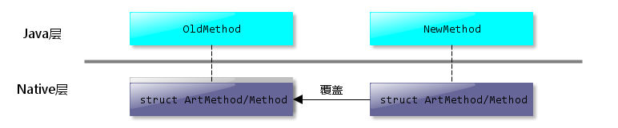
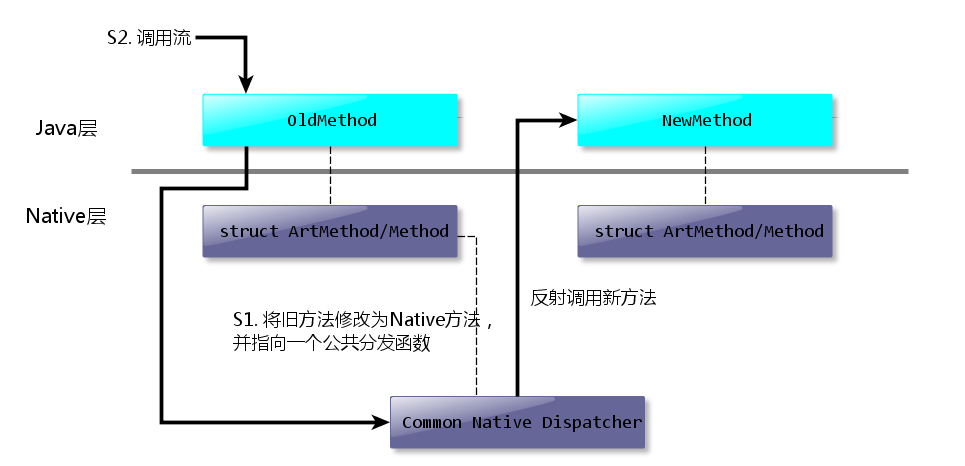
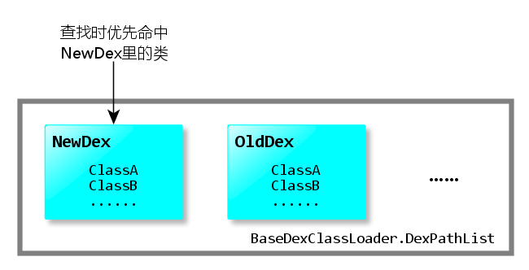
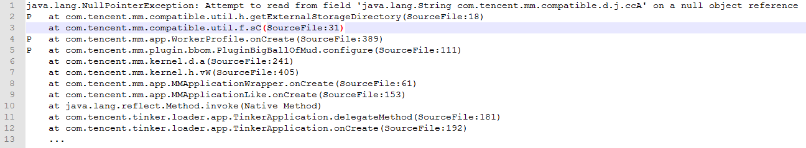
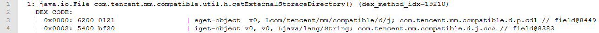
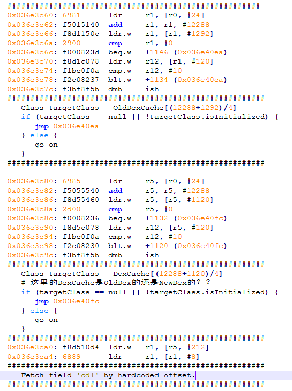
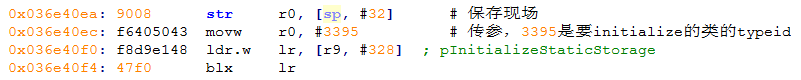

### ART下的方法内联策略及其对Android热修复方案的影响分析
**tomystang**

----

> 为了解决ART模式下的占用Rom空间问题，Tinker曾经花了一个半月时间实现分平台合成。Android N后对内联的新发现，似乎再一次认证了"热补丁不是请客吃饭"这句话。
> 
> 研究或填坑的路可能永远不会停，但Tinker团队有决心与信心可以陪大家一起走下去。

#### 0x00 背景
&emsp;&emsp;ART（Android Runtime）是Android在4.4版本中引入的新虚拟机环境，在5.0版本正式取代了Dalvik VM。ART环境下，App安装时其包含的Dex文件将被dex2oat预编译成目标平台的机器码，从而提高了App的运行效率。在这个预编译过程中，dex2oat对目标代码的优化过程与Dalvik VM下的dexopt有较大区别，尤其是在5.0版本以后ART环境下新增的方法内联优化。由于方法内联改变了原本的方法分布和调用流程，对热修复方案势必会带来影响，本文将分析ART下方法内联策略，并总结方法内联对现有的主流热修复方案造成的影响。

&emsp;&emsp;浏览Android源码可知，Android用来生成oat文件的Compiler有多种实现，各Android版本中存在的实现类型和默认使用的类型如下：

| 版本         | Compiler类型                | 默认使用的类型 | 备注                              |
| :---------- | :-------------------------- | :---------- | :-------------------------------- |
| Android 4.4 | kQuick                      | kQuick      | 此版kQuick未引入方法内联优化         |
| Android 5.x | kQuick,kOptimizing,kPortable| kQuick      | kPortable是半成品，并没有实际被使用   |
| Android 6.x | kQuick,kOptimizing          | kQuick      | 从此版本开始，kOptimizing加入下文归纳的新内联特性|
| Android 7.0 | kOptimizing                 | kOptimizing | |
| Android 7.1 | kOptimizing                 | kOptimizing | |

其中Quick Compiler的方法内联条件可以从`art/runtime/quick/inline_method_analyser.cc`里的`InlineMethodAnalyser::AnalyseMethodCode`方法开始分析，篇幅关系这里直接给出结论。对于Quick Compiler，当以下条件**均满足**时被调用的方法将被inline：
1. App不是Debug版本的；
2. 被调用方法的实现满足下列条件之一：
2.1.  空方法；
2.2. 仅返回方法参数；
2.3. 仅返回一个方法内声明的常量或null；
2.4. 从被调用方法所在类的非静态成员获取并返回获取的值；（注意，static final成员会被优化成常量，此时要参照2.3）
2.5. 仅设置了被调用方法所在类的**非静态**成员的值；
2.6. 仅设置了被调用方法所在类的**非静态**成员的值，并返回一个方法内声明的常量或null。

注：条件2隐含了一个条件，就是被调用的方法的字节码不超过2条。

Optimizing Compiler的内联条件可以从`art/compiler/optimizing/inliner.cc`里的`HInliner::Run()`方法开始分析，篇幅关系这里同样直接给出结论。对于Optimizing Compiler，当以下条件**均满足**时被调用的方法将被inline：
1. App不是Debug版本的；
2. 被调用的方法所在的类与调用者所在的类位于同一个Dex；（注意，符合Class N命名规则的多个Dex要看成同一个Dex）
3. 被调用的方法的字节码条数不超过dex2oat通过`--inline-max-code-units`指定的值，6.x默认为100，7.x默认为32；
4. 被调用的方法不含try块；
5. 被调用的方法不含非法字节码；
6. 对于7.x版本，被调用方法还不能包含对接口方法的调用。（invoke-interface指令）

此外，Optimizing Compiler的方法内联可以跨多级方法调用进行，若有这样的调用链：method1->method2->method3->method4，则在四个方法都满足内联条件的情况下，最终内联的结果将是method1包含method2，method3，method4的代码，method2包含method3，method4的代码，以此类推。但这种跨调用链内联会受到调用dex2oat时通过`--inline-depth-limit`参数指定的值的限制，默认为5，即超过5层的调用就不会再被内联到当前方法了。

#### 0x01 主流热修复方案

&emsp;&emsp;目前主流热修复方案可分为Native派和Java派，Native派的做法大致有以下两种：

Java派的做法也有两种：

&emsp;&emsp;显然，对Native派而言，如果修改的方法被内联到了调用者的代码里，则修改将不会生效，因为内联的代码不再需要方法调用，也就不会涉及到额外的Native层方法描述结构体。对于Java派而言，插入一段逻辑的做法基本不受影响，因为内联时会将被修改的函数连同插入的那段逻辑一起复制到调用者的代码里，结果和内联之前是等价的。但通过优先加载补丁Dex里的类来取代旧类的做法会受到怎样的影响呢？这就需要进一步分析了。

#### 0x02 方法内联对Tinker的影响

&emsp;&emsp;Tinker通过让VM优先加载补丁Dex里的类来使补丁生效，即Java派里的第一种方案。在没有考虑到内联的影响之前，这套方案有些兼容性问题已得到解决，但在最近的灰度过程中，我们又发现了这样的Crash：

其中compatible.d.j的实例在类compatible.d.p里是定义时赋值给cdl字段的，按理说不该为Null，看着好像又是地址错乱的问题了，于是按照之前的经验，dump了栈顶附近几个方法的机器码，发现`f.sC`方法内联了`h.getExternalStorageDirectory`方法，不过现在还不能肯定是不是内联带来的问题，于是跟着`f.sC`方法的机器码走一段：

图里(12288+1292)/4 = 3395，对应compatible.util.h的typeid；(12288+1120) / 4 = 3352，对应compatible.d.p的typeid。图里提到的DexCache是一个缓存数组，用来存放resolve过的类的地址。由机器码的这一行

 `0x036e3c80: 6985    	ldr     r5, [r0, #24]` 

可知，用来检查compatible.d.p是否resolve过的DexCache是从compatible.util.h的Native结构里的某个字段获取的，这样我们只要知道compatible.util.h的DexCache是OldDex的还是NewDex的就可以了。于是回到上面判断compatible.util.h那部分，我们跟着机器码跳到0x036e40ea的位置：

这个`pInitializeStaticStorage`实际上就是`artInitializeStaticStorageFromCode`方法，看`art/runtime/arch/arm/quick_entrypoints_arm.S`就知道了。从`artInitializeStaticStorageFromCode`方法开始又依次调用了`ResolveVerifyAndClinit` -> `ClassLinker::ResolveType`，经过几个不同原型的ResolveType之后最终调到了`ClassLinker::FindClass`，从FindClass开始就是经典的ART加载类的流程了，大家可以参考老罗的这篇文章：[Android运行时ART加载类和方法的过程分析](http://blog.csdn.net/luoshengyang/article/details/39533503)。根据这个流程，最后被加载的compatible.util.h来自NewDex，所以保存在它的Native描述结构体里的DexCache就是NewDex的了。

&emsp;&emsp;搞清楚这个问题之后，我们再来看为何会报NPE。回到f.sC方法的机器码，我们看第二部分，在从r0+24这个位置拿到DexCache之后，接着就会判断compatible.d.p是否被resolve，然后问题就来了，既然这个DexCache是NewDex的，那机器码里用3352这个OldDex里的typeid来访问究竟靠谱吗？和之前那个地址错乱的问题类似，这里会遇到三种情况：

| 情况                                             | 后果                                     |
| :-----------------------------------------------| :-------------------------------------- |
| oldDex里的typeid恰好就是newDex里的typeid           | 没事，补丁正常生效                         |
| oldDex里的typeid >= newDex的DexCache的长度        | 被SIGABORT干掉，Abort Message为数组下标越界 |
| oldDex里的typeid在newDex的DexCache里指向了其他类    | 无法预料，可能崩溃，可能导致程序流程异常       |

如果你的补丁变更规模很小，一般会大概率命中第二种情况；如果你的补丁变更规模很大，则会有很大概率命中第三种情况。微信这次灰度报的crash对应的就是第三种情况了，所以最后通过offset去拿成员的值的时候会拿到0，于是就报了NPE。

#### 0x03 可能的应对方案

&emsp;&emsp;参考0x01里的内联条件，如果阻止方法内联，就可以避免出现机器码里用旧typeid去新DexCache里查找类的情况了。对我们来说比较方便的条件就是在每个方法前面插入一个空try块，这样这些方法就不会参与内联了。不过考虑到ART的内联触发条件随时都在更新，保险起见Tinker并没有这样做。

&emsp;&emsp;另外一个思路是把修改类的整个调用链(调用修改类的类，与调用[调用修改类的类]的类，一直递归下去)都放到补丁中，需要包括所有可能被影响的类。这套规则的主要问题在于整个完整调用链的类会非常庞大，很有可能与全量差别不大，其次不排除Android未来有新的优化导致这样的方式会失效。

&emsp;&emsp;Tinker最终采用的应对方案是去掉ART环境下的合成增量Dex的逻辑，直接合成全量的NewDex，这样除了loader类，所有方法统一都用了NewDex里的，也就不怕有方法被内联了。至于全量新Dex在系统OTA之后触发dex2oat可能导致App启动时ANR的问题，Tinker是通过在进入ApplicationLike之前判断fingerprint是否变化来得知系统是否进行过OTA，然后根据判断结果手动触发多线程dex2oat加以缓解的。

#### 0x04 总结

&emsp;&emsp;方法内联之所以会导致优先加载补丁Dex的方案出现上述问题，本质上是因为补丁Dex只覆盖了旧Dex里的一部分类，一旦被覆盖的类的方法被内联到了调用者里，则加载类的过程还是正常的，即从补丁Dex里加载了新版本的类。但由于内联，执行流程并未跳转到新的方法里，于是所有关于新版本的类的方法、成员、字符串的查找用的就都是旧方法里的索引了。这里“用旧索引找新目标”的场景又出现了，App自然可能出现异常。

&emsp;&emsp;ART 6.0及之后的Optimizing Compiler通过相对激进的内联策略，进一步提升了App的运行效率，但这也为各类热修复方案带来了一些麻烦。通过分析，理论上我们确实可以通过破坏内联条件强行让所有的方法都不参与内联，但这样一来App的运行时性能就会受到较大影响，而且今后如果内联标准更新了，我们还需要持续跟进，这也是不太现实的。因此通过这次灰度发现的问题，我们最终还是用了相对保守的方案来解决。

&emsp;&emsp;最后，通过分析这个问题，我们也更加深刻地认识到了ART的复杂性。时间仓促，关于方法内联的策略及其带来的问题还有许多细节并没有在这篇文章里提及，如果有补充的知识或者更好的应对方案，欢迎一同交流学习。