# 微信Android热补丁实践演进之路 #
继插件化后，热补丁技术在2015年开始爆发，目前已经是非常热门的Android开发技术。其中比较著名的有淘宝的Dexposed、支付宝的AndFix以及QZone的超级热补丁方案。微信对热补丁技术的研究并不算早，大约开始于2015年6月。经过研究与尝试现有的各个方案，我们发现它们都有着自身的一些局限性。微信最终采用不同于它们的技术方案，走出了自己的实践演进之路。

另外一方面，技术应当只是热补丁方案中的一环。随着对热补丁的多次尝试与应用，微信建立起自身的流程规范，同时也不断的尝试拓展它的应用场景。通过本文，我希望大家不仅能够全面的了解各项热补丁技术的优缺点，同时也能对它的应用场景有着更加全面的认识。在此基础上，大家或许能更容易的决定是否在自己的项目中使用热补丁技术，以及应当如何使用它。

## 为什么需要热补丁 ##

> 热补丁：让应用能够在无需重新安装的情况实现更新，帮助应用快速建立动态修复能力。

从上面的定义来看，热补丁节省Android大量应用市场发布的时间。同时用户也无需重新安装，只要上线就能无感知的更新。看起来很美好，这是否可以意味我们可以尽量使用补丁来代替发布呢？事实上，热补丁技术当前依然存在它的局限性，主要表现在以下几点：

1.  补丁只能针对单一客户端版本，随着版本差异变大补丁体积也会增大；
2.  补丁不能支持所有的修改，例如AndroidManifest；
3.  补丁无论对代码还是资源的更新成功率都无法达到100%。

既然补丁技术无法完全代替升级，那它适合使用在哪些场景呢？

###一. 轻量而快速的升级 ###

热补丁技术也可以理解为一个动态修改代码与资源的通道，它适合于修改量较少的情况。以微信的多次发布为例，补丁大小均在300K以内，它相对于传统的发布有着很大的优势。

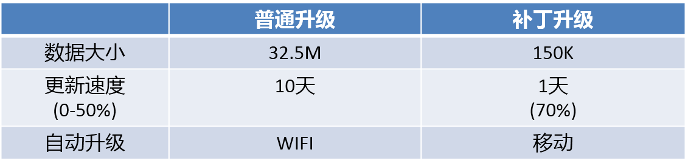

以Android用户的升级习惯，即使是相对活跃的微信也需要10天以上的时间去覆盖50%的用户。使用补丁技术，我们能做到1天覆盖70%以上。这也是基于补丁体积较小，可以直接使用移动网络下载更新。

正因如此，补丁技术非常适合使用在灰度阶段。在过去，我们需要在正式发布前保证所有严重的问题都已经得到修复，这通常需要我们经过三次以上的灰度过程，而且无法快速的验证这些问题在同一批用户的修复效果。利用热补丁技术，我们可以快速对同一批用户验证修复效果，这大大缩短了我们的发布流程。

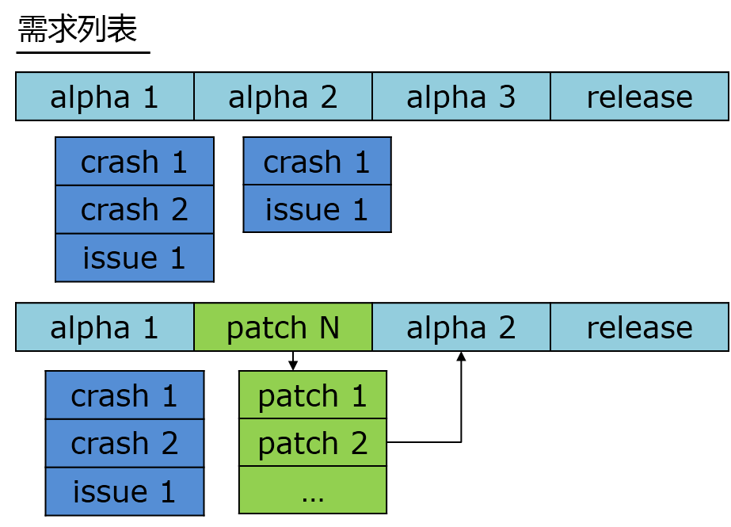

若发布版本出现问题或紧急漏洞，传统方式需要单独灰度验证修改，然后重新发布新的版本。利用补丁技术，我们只需要先上线小部分用户验证修改的效果，最后再全量上线即可。但是此种发布对线上用户影响较大， 我们需要谨慎而为。本着对用户负责的态度，**发布补丁等同于发布版本**，它也应该严格执行完整的测试与上线流程。

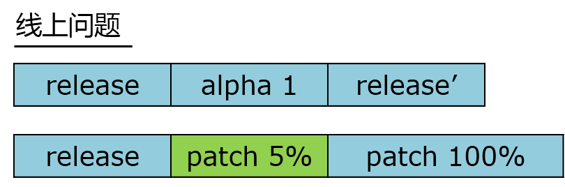

总的来说，补丁技术可以降低开发成本，缩短开发周期，实现轻量而快速的升级。

###二. 远端调试###

一入Android深似海，Android开发的另外一个痛是机型的碎片化。我们也许都会遇到"本地不复现"，"日志查不出"，"联系用户不鸟你"的烦恼。所以补丁机制非常适合使用在远端调试上。即我们需要具备只特定用户发送补丁的能力，这对我们查找问题非常有帮助。

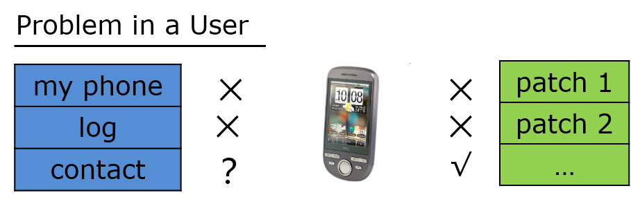

利用补丁技术，我们避免了骚扰用户而默默的为用户解决问题。当然这也需要非常严格的权限管理，以防恶意或随意使用。

###三. 数据统计###

数据统计在微信中也占据着非常重要的位置，我们也非常希望将热补丁与数据统计结合的更好。事实上，热补丁无论在普通的数据统计还是ABTest都有着非常大的优势。例如若我想对同一批用户做两种test, 传统方式无法让这批用户去安装两个版本。使用补丁技术，我们可以方便的对同一批用户不停的更换补丁。

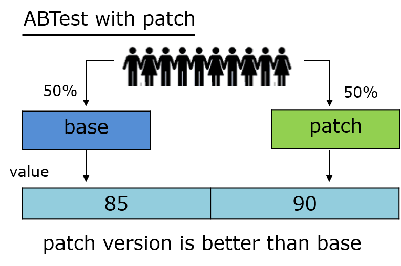

在数据统计之路，如何与补丁技术结合的更好，更加精准的控制样本人数与比例，这也是微信当前努力发展的一个方向。

###四. 其他###
事实上，Android官方也使用热补丁技术实现Instant Run。它分为Hot Swap、Warm Swap与Cold Swap三种方式，大家可以参考[英文介绍](https://medium.com/google-developers/instant-run-how-does-it-work-294a1633367f#.c088qhdxu)，也可以看参考文章中的翻译稿。最新的Instant App应该也是采用类似的原理，但是Google Play是不允许下发代码的，这个海外App需要注意一下。

## 微信热补丁技术的演进之路 ##
在了解补丁技术可以与适合做什么之后，我们回到技术本身。由于[Dexposed](https://github.com/alibaba/dexposed)无法支持全平台，并不适合应用到商业产品中。所以这里我们只简单介绍Andfix、QZone、微信几套方案的实现，以及它们方案面临着的问题，大家也可以参考资料中的[各大热补丁方案分析和比较](http://blog.zhaiyifan.cn/2015/11/20/HotPatchCompare/)一文。

###一. AndFix###
[AndFix](https://github.com/alibaba/AndFix)采用native hook的方式，这套方案直接使用`dalvik_replaceMethod`替换class中方法的实现。由于它并没有整体替换class, 而field在class中的相对地址在class加载时已确定，所以AndFix无法支持新增或者删除filed的情况(通过替换`init`与`clinit`只可以修改field的数值)。

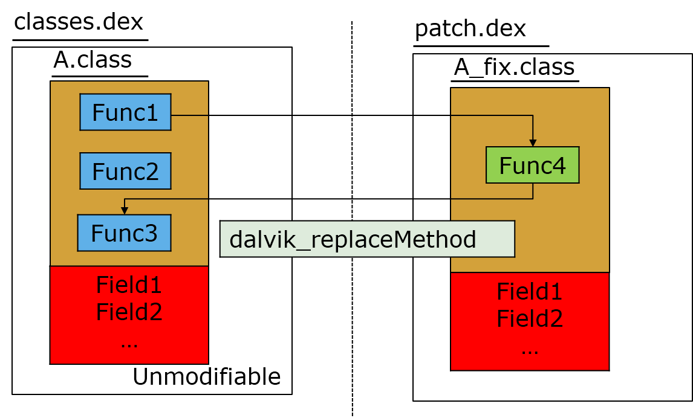

也正因如此，Andfix可以支持的补丁场景相对有限，仅仅可以使用它来修复特定问题。结合之前的发布流程，我们更希望补丁对开发者是不感知的，即他不需要清楚这个修改是对补丁版本还是正式发布版本(事实上我们也是使用git分支管理+cherry-pick方式)。另一方面，使用native替换将会面临比较复杂的兼容性问题。

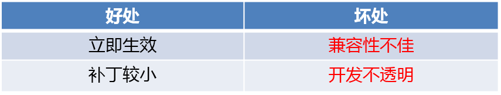

相比其他方案，AndFix的最大优点在于立即生效。事实上，AndFix的实现与[Instant Run的热插拔](http://www.jianshu.com/p/2e23ba9ff14b)有点类似，但是由于使用场景的限制，微信在最初期已排除使用这一方案。

###二. QZone###
QZone方案并没有开源，但在github上的[Nuwa](https://github.com/jasonross/Nuwa)采用了相同的方式。这个方案使用classloader的方式，能实现更加友好的类替换。而且这与我们加载Multidex的做法相似，能基本保证稳定性与兼容性。具体原理在这里不再细说，大家可以[参考这篇文章](https://mp.weixin.qq.com/s?__biz=MzI1MTA1MzM2Nw==&mid=400118620&idx=1&sn=b4fdd5055731290eef12ad0d17f39d4a)。

本方案为了解决`unexpected DEX problem`异常而采用插桩的方式，从而规避问题的出现。事实上，Android系统的这些检查规则是非常有意义的，这会导致QZone方案在Dalvik与Art都会产生一些问题。

- Dalvik； 在dexopt过程，若class verify通过会写入pre-verify标志，在经过optimize之后再写入odex文件。这里的optimize主要包括inline以及quick指令优化等。
 
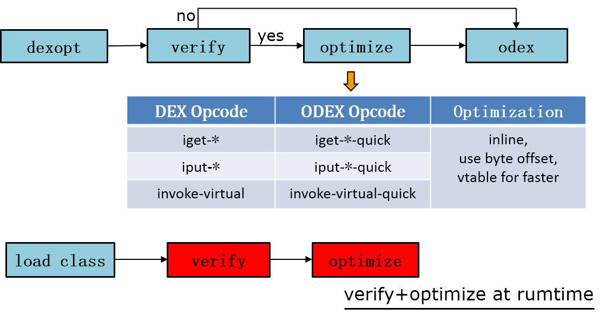

若采用插桩导致所有类都非preverify，这导致verify与optimize操作会在加载类时触发。这会有一定的性能损耗，微信分别采用插桩与不插桩两种方式做过两种测试，一是连续加载700个50行左右的类，一是统计微信整个启动完成的耗时。

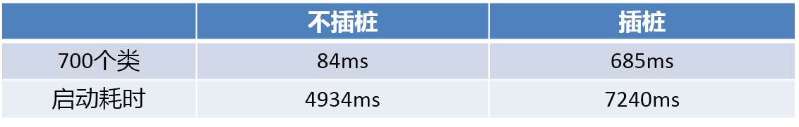

平均每个类verify+optimize(跟类的大小有关系)的耗时并不长，而且这个耗时每个类只有一次。但由于启动时会加载大量的类，在这个情况影响还是比较大的。

- Art； Art采用了新的方式，插桩对代码的执行效率并没有什么影响。但是若补丁中的类出现修改类变量或者方法，可能会导致出现内存地址错乱的问题。为了解决这个问题我们需要将修改了变量、方法以及接口的类的父类以及调用这个类的所有类都加入到补丁包中。这可能会带来补丁包大小的急剧增加。

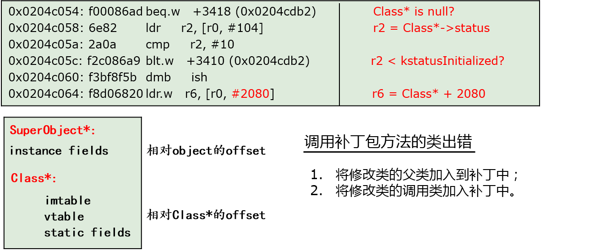

这里是因为在dex2oat时`fast*`已经将类能确定的各个地址写死。如果运行时补丁包的地址出现改变，原始类去调用时就会出现地址错乱。这里说的可能不够详细，事实上微信当时为了查清这两个问题，也花费了一定的时间将Dalvik跟Art的流程基本搞透。若大家对这里感兴趣，后续在单独的文章详细论述。

总的来说，Qzone方案好处在于开发透明，简单，这一套方案目前的应用成功率也是最高的，但在补丁包大小与性能损耗上有一定的局限性。特别是无论我们是否真正应用补丁，都会因为插桩导致对程序运行时的性能产生影响。微信对于性能要求较高，所以我们也没有采用这套方案。

###三. 微信热补丁方案###

有没有那么一种方案，能做到开发透明，但是却没有QZone方案的缺陷呢？Instant Run的冷插拔与buck的[exopackage](https://buckbuild.com/article/exopackage.html)或许能给我们灵感，它们的思想都是全量替换新的Dex。即我们完全使用了新的Dex，那样既不出现Art地址错乱的问题，在Dalvik也无须插桩。当然考虑到补丁包的体积，我们不能直接将新的Dex放在里面。但我们可以将新旧两个Dex的差异放到补丁包中，最简单我们可以采用BsDiff算法。

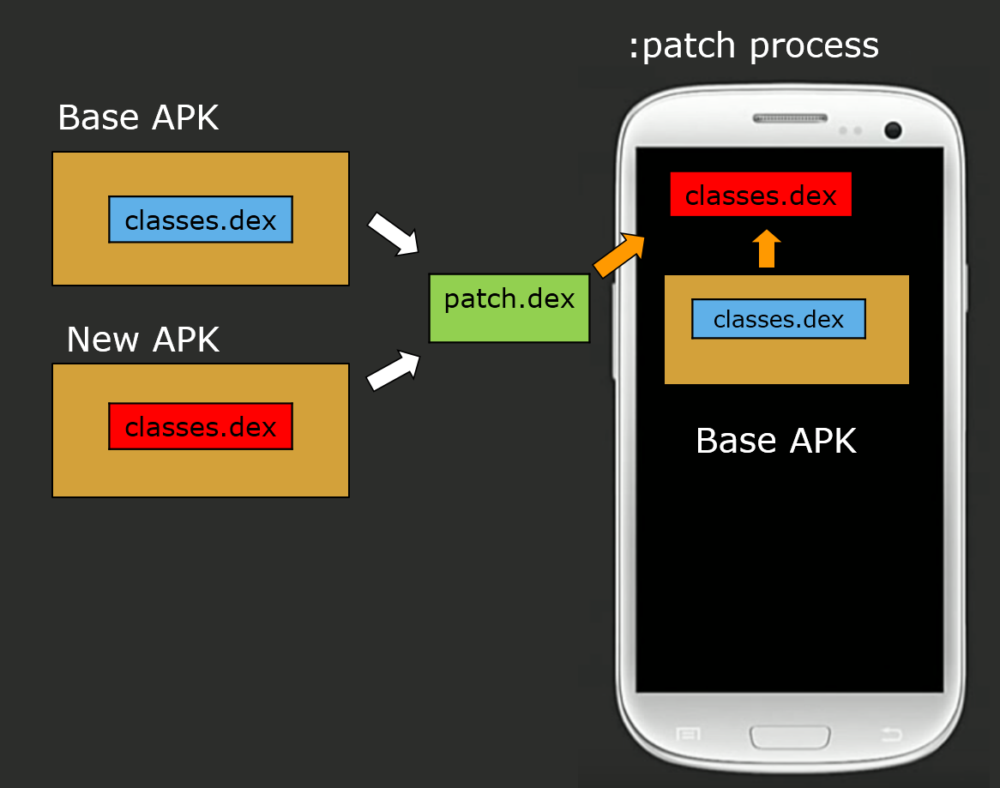

简单来说，在编译时通过新旧两个Dex生成差异path.dex。在运行时，将差异patch.dex重新跟原始安装包的旧Dex还原为新的Dex。这个过程可能比较耗费时间与内存，所以我们是单独放在一个后台进程:patch中。为了补丁包尽量的小，微信自研了DexDiff算法，它深度利用Dex的格式来减少差异的大小。它的粒度是Dex格式的每一项，可以充分利用原本Dex的信息，而BsDiff的粒度是文件，AndFix/QZone的粒度为class。

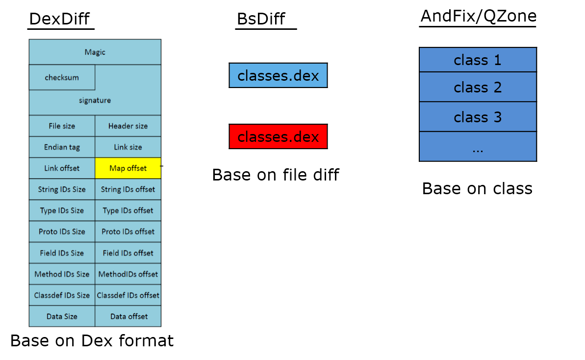

这块后面我希望后面用单独的文章来讲述，这里先做一个铺垫，大致的效果如下图。在最极端的情况，由于利用了原本dex的信息完全替换一个13M的Dex，我们的补丁大小也仅仅只有6.6M。

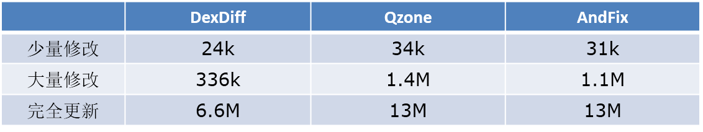

但是这套方案并非没有缺点，它带来的问题有两个：

1. 占用Rom体积；这边大约是你修改Dex数量的1.5倍(dexopt与dex压缩成jar)的大小。
2. 一个额外的合成过程；虽然我们单独放在一个进程上处理，但是合成时间的长短与内存消耗也会影响最终的成功率。

> 微信的热补丁方案叫做Tinker，也算缅怀一下Dota中的地精修补匠，希望能做到无限刷新。
> 
> 

限于篇幅，这里对Dex、library以及资源的更多技术细节并没有详细的论述，这里希望放在后面的单独文章中。我们最后从整体比较一下这几种方案：

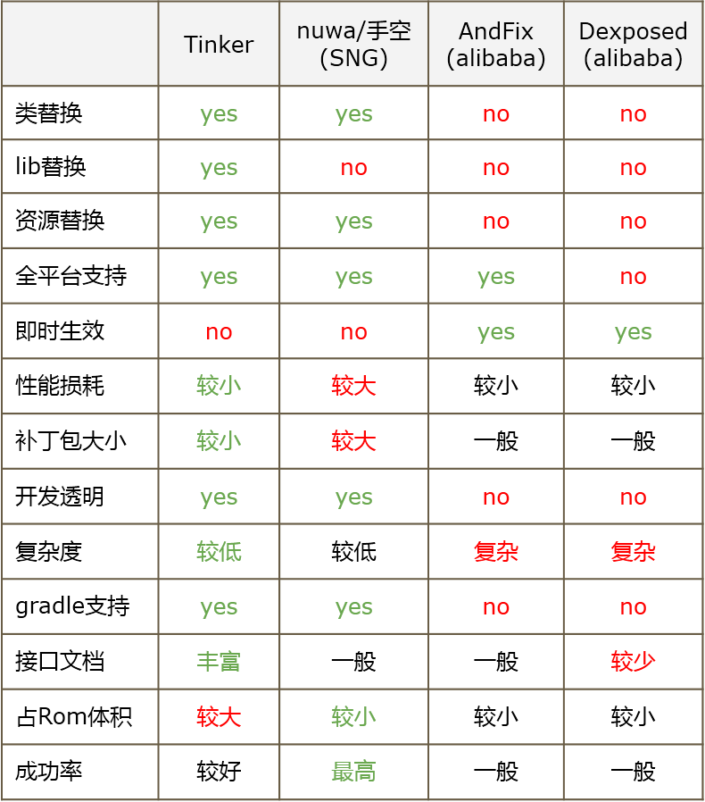

若不care性能损耗与补丁包大小，QZone方案是最简单且成功率最高的方案(没有单独的合成过程)。相对Tinker来说，它的占用Rom体积也更小。另一方面，QZone与Tinker的成功率大约相差3%左右。

事实上，一个完整的框架应该也是一个容易使用的框架。Tinker对补丁版本管理、进程管理、安全校验等都有着很好的支持。同时我们也支持gradle与命名行两种接入方式。希望在不久的将来，它可以很快的跟大家见面。

## 微信的热补丁应用现状 ##
上一章节我们简单比较了各个热补丁的技术方案，它们解决了如何生成与加载补丁包的问题。但一个完善的热补丁系统不应该仅限于此，它还需要包括以下几个方面：

- 网络通道；这里要解决的问题是决定补丁以何种方式推送给哪部分的用户。
- 上线与后台管理平台；这里主要包括热补丁的上线管理，历史管理以及上报分析，报警监控等；

###一. 网络通道现状###

网络通道负责的将补丁包交付给用户，这个包括特定用户与全量用户两种情况。事实上，微信当前针对热补丁有以下三种通道更新：

- pull通道; 在登陆/24小时等时机，通过pull方式查询后台是否有对应的补丁包更新，这也是我们最常用的方式；
- 指定版本的push通道; 针对版本的通道，在紧急情况下，我们可以在一个小时内向所有用户下发补丁包更新。
- 指定特定用户的push通道;对特定用户或用户组做远程调试。

事实上，对于大部分的应用来说，假设不实现push通道，CDN+pull通道实现起来还是较为容易。

###二. 上线与管理平台现状###

上线与管理平台主要为了快速上线，管理历史记录，以及监控补丁的运行情况等。

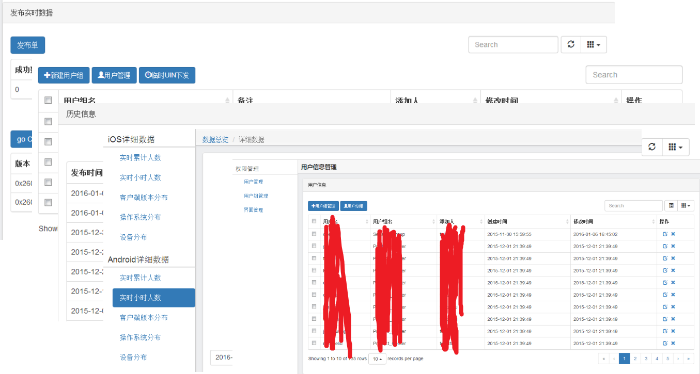

事实上，微信发布热补丁是非常慎重的。它整个发布流程与升级版本是保持一致的，也必须修改版本号、经过严格的完整测试流程等。我们也会通过灰度的方式上线，同时监控补丁版本的各个指标。这里的为了完整的监控补丁的情况，我们做的工作有：

- 1分钟粒度的每小时/每天的各版本累积用户，及时监控补丁版本的人数与活跃；
- 3分钟粒度的Crash统计，基准版本与补丁版本的Crash每小时/每天的两个维度对照；
- 10分钟粒度的补丁监控信息上报。

###三. 补丁成功率现状###
> 应用成功率= 补丁版本人数/补丁发布前该版本人数
> 由于可能存在基准或补丁版本用户安装了其他版本，所以本统计结果应略为偏低，但它能现实的反应补丁的线上覆盖情况。

使用Qzone方案，微信补丁在10天后的应用成功率大约在98.5%左右。使用Tinker大约只有95.5%左右，主要原因在于空间不足以及后台进程被杀。在这里我们也在尝试使用重试的方式以及降低合成的耗时与内存，从而提升成功率。

热补丁技术发展的很快，Android推出的Instant App也令人期待。但是在国内，似乎我们还是指望自己更靠谱一点。每一个的应用的需求都不太一致，这里大致讲了一些微信的实践经验，希望对大家有帮助。

## 未来工作 ##

随着微信部门内从“单APP”向“多APP”演进，微信也正在迈入开源化的开发实践。我们希望将各个功能组件化，从而做可以到快速复制与应用。微信的热补丁框架“Tinker”当前也在经历从微信分离，又合入到微信的过程。希望在不久的将来，我们也可以将“Tinker”以及微信中一些其他的组件开源出去。

我们也希望可以找一个App作为内测，给我们提供宝贵的意见。若对微信的Tinker方案感兴趣的用户，可以单独发消息或在文章末留言。注明姓名、所在公司以及负责的App，我们希望挑选部分产品作为内测。

## 参考文章 ##
1. Dexposed github ([https://github.com/alibaba/dexposed](https://github.com/alibaba/dexposed))      
2. AndFix github ([https://github.com/alibaba/AndFix](https://github.com/alibaba/AndFix))   
3. Nuwa github ([https://github.com/jasonross/Nuwa](https://github.com/jasonross/Nuwa))      
4. QZone实现原理解析 ([https://mp.weixin.qq.com/s?__biz=MzI1MTA1MzM2Nw==&mid=400118620&idx=1&sn=b4fdd5055731290eef12ad0d17f39d4a](https://mp.weixin.qq.com/s?__biz=MzI1MTA1MzM2Nw==&mid=400118620&idx=1&sn=b4fdd5055731290eef12ad0d17f39d4a)) 
5. Instant Run英文原文 ([https://medium.com/google-developers/instant-run-how-does-it-work-294a1633367f#.c088qhdxu](https://medium.com/google-developers/instant-run-how-does-it-work-294a1633367f#.c088qhdxu))        
6. Instant Run工作原理及用法中文翻译稿 ([http://www.jianshu.com/p/2e23ba9ff14b](http://www.jianshu.com/p/2e23ba9ff14b))        
7. Buck exopackage 介绍 ([https://buckbuild.com/article/exopackage.html](https://buckbuild.com/article/exopackage.html))   
8. 各大热补丁方案分析和比较 ([http://blog.zhaiyifan.cn/2015/11/20/HotPatchCompare/](http://blog.zhaiyifan.cn/2015/11/20/HotPatchCompare/))                                     