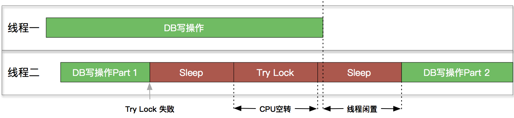
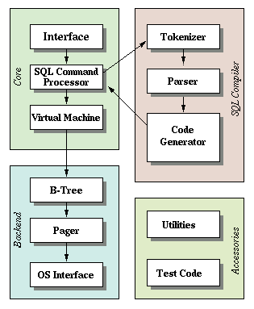
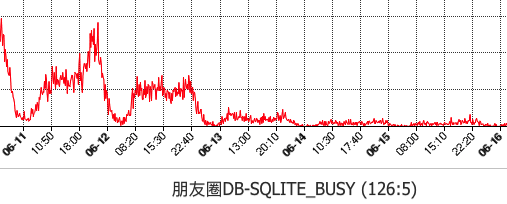
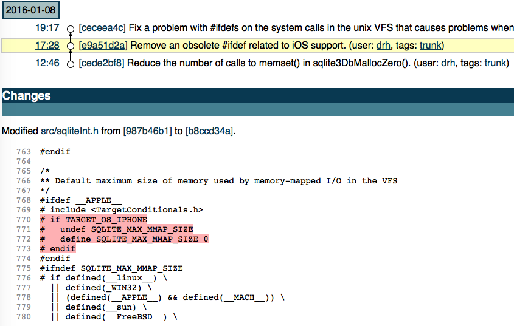
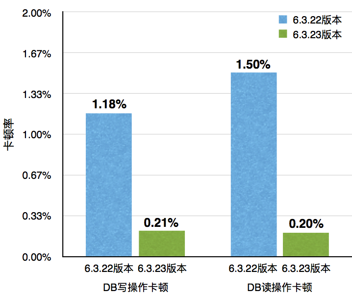

## 前言

随着微信iOS客户端业务的增长，在数据库上遇到的性能瓶颈也逐渐凸显。在微信的卡顿监控系统上，数据库相关的卡顿不断上升。而在用户侧也逐渐能感知到这种卡顿，尤其是有大量群聊、联系人和消息收发的重度用户。

我们在对SQLite进行优化的过程中发现，靠单纯地修改SQLite的参数配置，已经不能彻底解决问题。因此从6.3.16版本开始，我们合入了SQLite的源码，并开始进行源码层的优化。

本文将分享在SQLite源码上进行的多线程并发、I/O性能优化等，并介绍优化相关的SQLite原理。

## 多线程并发优化

#### 1. 背景

由于历史原因，旧版本的微信一直使用单句柄的方案，即所有线程共有一个SQLite Handle，并用线程锁避免多线程问题。当多线程并发时，各线程的数据库操作同步顺序进行，这就导致后来的线程会被阻塞较长的时间。

#### 2. SQLite的多句柄方案及Busy Retry方案

SQLite实际是支持多线程（几乎）无锁地并发操作。只需

1. 开启配置 `PRAGMA SQLITE_THREADSAFE=2`
2. 确保同一个句柄同一时间只有一个线程在操作

> [Multi-thread. In this mode, SQLite can be safely used by multiple threads provided that no single database connection is used simultaneously in two or more threads.](http://www.sqlite.org/threadsafe.html)

倘若再开启SQLite的WAL模式（Write-Ahead-Log），多线程的并发性将得到进一步的提升。

此时写操作会先append到wal文件末尾，而不是直接覆盖旧数据。而读操作开始时，会记下当前的WAL文件状态，并且只访问在此之前的数据。这就确保了多线程**读与读**、**读与写**之间可以并发地进行。

然而，阻塞的情况并非不会发生。

* 当多线程写操作并发时，后来者还是必须在源码层等待之前的写操作完成后才能继续。

SQLite提供了Busy Retry的方案，即发生阻塞时，会触发Busy Handler，此时可以让线程休眠一段时间后，重新尝试操作。重试一定次数依然失败后，则返回`SQLITE_BUSY`错误码。

```c
static int sqliteDefaultBusyCallback(
 void *ptr,               /* Database connection */
 int count                /* Number of times table has been busy */
){
  sqlite3 *db = (sqlite3 *)ptr;
  int timeout = ((sqlite3 *)ptr)->busyTimeout;
  if( (count+1)*1000 > timeout ){
    return 0;
  }
  sqlite3OsSleep(db->pVfs, 1000000);
  return 1;
}
```

#### 3. SQLite Busy Retry方案的不足

Busy Retry的方案虽然基本能解决问题，但对性能的压榨做的不够极致。在Retry过程中，休眠时间的长短和重试次数，是决定性能和操作成功率的关键。

然而，它们的最优值，因不同操作不同场景而不同。若休眠时间太短或重试次数太多，会空耗CPU的资源；若休眠时间过长，会造成等待的时间太长；若重试次数太少，则会降低操作的成功率。



我们通过A/B Test对不同的休眠时间进行了测试，得到了如下的结果：


可以看到，倘若休眠时间与重试成功率的关系，按照绿色的曲线进行分布，那么p点的值也不失为该方案的一个次优解。然而事总不遂人愿，我们需要一个更好的方案。

#### 4. SQLite中的线程锁及进程锁

作为有着十几年发展历史、且被广泛认可的数据库，SQLite的任何方案选择都是有其原因的。在完全理解由来之前，切忌盲目自信、直接上手修改。因此，首先要了解SQLite是如何控制并发的。



SQLite是一个适配不同平台的数据库，不仅支持多线程并发，还支持多进程并发。它的核心逻辑可以分为两部分：

* Core层。包括了接口层、编译器和虚拟机。通过接口传入SQL语句，由编译器编译SQL生成虚拟机的操作码opcode。而虚拟机是基于生成的操作码，控制Backend的行为。
* Backend层。由B-Tree、Pager、OS三部分组成，实现了数据库的存取数据的主要逻辑。

在架构最底端的OS层是对不同操作系统的系统调用的抽象层。它实现了一个VFS（Virtual File System），将OS层的接口在编译时映射到对应操作系统的系统调用。锁的实现也是在这里进行的。

SQLite通过两个锁来控制并发。第一个锁对应DB文件，通过5种状态进行管理；第二个锁对应WAL文件，通过修改一个16-bit的unsigned short int的每一个bit进行管理。尽管锁的逻辑有一些复杂，但此处并不需关心。这两种锁最终都落在OS层的`sqlite3OsLock`、`sqlite3OsUnlock`和`sqlite3OsShmLock`上具体实现。

它们在锁的实现比较类似。以lock操作在iOS上的实现为例：

1. 通过`pthread_mutex_lock`进行线程锁，防止其他线程介入。然后比较状态量，若当前状态不可跳转，则返回`SQLITE_BUSY`
2. 通过`fcntl`进行文件锁，防止其他进程介入。若锁失败，则返回`SQLITE_BUSY`

而SQLite选择Busy Retry的方案的原因也正是在此－－－**文件锁没有线程锁类似pthread_cond_signal的通知机制。当一个进程的数据库操作结束时，无法通过锁来第一时间通知到其他进程进行重试。因此只能退而求其次，通过多次休眠来进行尝试。**

#### 5. 新的方案

通过上面的各种分析、准备，终于可以动手开始修改了。

我们知道，iOS app是单进程的，并**没有多进程并发的需求**，这和SQLite的设计初衷是不相同的。这就给我们的优化提供了理论上的基础。在iOS这一特定场景下，我们可以舍弃兼容性，提高并发性。

新的方案修改为，当OS层进行lock操作时：

1. 通过`pthread_mutex_lock`进行线程锁，防止其他线程介入。然后比较状态量，若当前状态不可跳转，则将当前期望跳转的状态，插入到一个FIFO的Queue尾部。最后，线程通过`pthread_cond_wait`进入 休眠状态，等待其他线程的唤醒。
2. 忽略文件锁

当OS层的unlock操作结束后：

1. 取出Queue头部的状态量，并比较状态是否能够跳转。若能够跳转，则通过`pthread_cond_signal_thread_np`唤醒对应的线程重试。

> `pthread_cond_signal_thread_np`是Apple在pthread库中新增的接口，与`pthread_cond_signal`类似，它能唤醒一个等待条件锁的线程。不同的是，`pthread_cond_signal_thread_np`可以指定一个特定的线程进行唤醒。


新的方案可以在DB空闲时的第一时间，通知到其他正在等待的线程，最大程度地降低了空等待的时间，且准确无误。此外，由于Queue的存在，当主线程被其他线程阻塞时，可以将主线程的操作“插队”到Queue的头部。当其他线程发起唤醒通知时，主线程可以有更高的优先级，从而降低用户可感知的卡顿。

该方案上线后，卡顿检测系统检测到

* 等待线程锁的造成的卡顿下降超过90%


* SQLITE_BUSY的发生次数下降超过95%

  

  

## I/O 性能优化

#### 保留WAL文件大小

如上文多线程优化时提到，开启WAL模式后，写入的数据会先append到WAL文件的末尾。待文件增长到一定长度后，SQLite会进行checkpoint。这个长度默认为1000个页大小，在iOS上约为3.9MB。

同样的，在数据库关闭时，SQLite也会进行checkpoint。不同的是，checkpoint成功之后，会将WAL文件长度删除或truncate到0。下次打开数据库，并写入数据时，WAL文件需要重新增长。而对于文件系统来说，这就意味着需要**消耗时间重新寻找合适的文件块**。

显然SQLite的设计是针对容量较小的设备，尤其是在十几年前的那个年代，这样的设备并不在少数。而随着硬盘价格日益降低，对于像iPhone这样的设备，几MB的空间已经不再是需要斤斤计较的了。

因此我们可以修改为：

* 数据库关闭并checkpoint成功时，不再truncate或删除WAL文件只修改WAL的文件头的Magic Number。下次数据库打开时，SQLite会识别到WAL文件不可用，重新从头开始写入。

> 保留WAL文件大小后，每个数据库都会有这约3.9MB的额外空间占用。如果数据库较多，这些空间还是不可忽略的。因此，微信中目前只对读写频繁且检测到卡顿的数据库开启，如聊天记录数据库。

#### mmap优化

mmap对I/O性能的提升无需赘言，尤其是对于读操作。SQLite也在OS层封装了mmap的接口，可以无缝地切换mmap和普通的I/O接口。只需配置`PRAGMA mmap_size=XXX`即可开启mmap。

> [There are advantages and disadvantages to using memory-mapped I/O. Advantages include:](https://www.sqlite.org/mmap.html)
>
> [Many operations, especially I/O intensive operations, can be much faster since content does need to be copied between kernel space and user space. In some cases, performance can nearly double.](https://www.sqlite.org/mmap.html)
>
> [The SQLite library may need less RAM since it shares pages with the operating-system page cache and does not always need its own copy of working pages.](https://www.sqlite.org/mmap.html)

然而，你在iOS上这样配置恐怕不会有任何效果。因为早期的iOS版本的存在一些bug，SQLite在编译层就关闭了在iOS上对mmap的支持，并且后知后觉地在[16年1月才重新打开](http://www.sqlite.org/src/info/e9a51d2a580daa0f)。所以如果使用的SQLite版本较低，还需注释掉相关代码后，重新编译生成后，才可以享受上mmap的性能。



开启mmap后，SQLite性能将有所提升，但这还不够。因为它只会对DB文件进行了mmap，而WAL文件享受不到这个优化。

WAL文件长度是可能变短的，而在多句柄下，对WAL文件的操作是并行的。一旦某个句柄将WAL文件缩短了，而没有一个通知机制让其他句柄进行更新mmap的内容。此时其他句柄若使用mmap操作已被缩短的内容，就会造成crash。而普通的I/O接口，则只会返回错误，不会造成crash。因此，SQLite没有实现对WAL文件的mmap。

还记得我们上一个优化吗？没错，我们保留了WAL文件的大小。因此它在这个场景下是不会缩短的，那么不能mmap的条件就被打破了。实现上，只需在WAL文件打开时，用`unixMapfile`将其映射到内存中，SQLite的OS层即会自动识别，将普通的I/O接口切换到mmap上。

## 其他优化

#### 禁用文件锁

如我们在多线程优化时所说，对于iOS app并没有多进程的需求。因此我们可以直接注释掉`os_unix.c`中所有文件锁相关的操作。也许你会很奇怪，虽然没有文件锁的需求，但这个操作耗时也很短，是否有必要特意优化呢？其实并不全然。耗时多少是比出来。

SQLite中有cache机制。被加载进内存的page，使用完毕后不会立刻释放。而是在一定范围内通过LRU的算法更新page cache。这就意味着，如果cache设置得当，大部分读操作不会读取新的page。然而因为文件锁的存在，本来只需在内存层面进行的读操作，不得不进行至少一次I/O操作。而我们知道，I/O操作是远远慢于内存操作的。

#### 禁用内存统计锁

SQLite会对申请的内存进行统计，而这些统计的数据都是放到同一个全局变量里进行计算的。这就意味着统计前后，都是需要加线程锁，防止出现多线程问题的。

```c
void *sqlite3Malloc(u64 n){
  void *p;
  if( n==0 || n>=0x7fffff00 ){
    /* A memory allocation of a number of bytes which is near the maximum
    ** signed integer value might cause an integer overflow inside of the
    ** xMalloc().  Hence we limit the maximum size to 0x7fffff00, giving
    ** 255 bytes of overhead.  SQLite itself will never use anything near
    ** this amount.  The only way to reach the limit is with sqlite3_malloc() */
    p = 0;
  }else if( sqlite3GlobalConfig.bMemstat ){
    sqlite3_mutex_enter(mem0.mutex);
    mallocWithAlarm((int)n, &p);
    sqlite3_mutex_leave(mem0.mutex);
  }else{
    p = sqlite3GlobalConfig.m.xMalloc((int)n);
  }
  assert( EIGHT_BYTE_ALIGNMENT(p) );  /* IMP: R-11148-40995 */
  return p;
}
```

内存申请虽然不是非常耗时的操作，但却很频繁。多线程并发时，各线程很容易互相阻塞。

阻塞虽然也很短暂，但频繁地切换线程，却是个很影响性能的操作，尤其是单核设备。

因此，如果不需要内存统计的特性，可以通过`sqlite3_config(SQLITE_CONFIG_MEMSTATUS, 0) `进行关闭。这个修改虽然不需要改动源码，但如果不查看源码，恐怕是比较难发现的。

优化上线后，卡顿监控系统监测到

* DB写操作造成的卡顿下降超过80%


* DB读操作造成的卡顿下降超过85%



## 结语

移动客户端数据库虽然不如后台数据库那么复杂，但也存在着不少可挖掘的技术点。本次尝试了仅对SQLite原有的方案进行优化，而市面上还有许多优秀的数据库，如LevelDB、RocksDB、Realm等，它们采用了和SQLite不同的实现原理。后续我们将借鉴它们的优化经验，尝试更深入的优化。