前言
==

**WCDB**（**W**e**C**hat **D**ata**B**ase）是微信官方的移动端数据库组件，致力于提供一个**高效**、**易用**、**完整**的移动端存储方案。

它包含三个模块：

* WCDB-iOS/Mac
* WCDB-Android
* 数据库损坏修复工具WCDBRepair

目前正在筹备开源中。

背景
==

对于iOS开发者来说，数据库的技术选型一直是个令人头痛的问题。由于Apple提供的CoreData框架差强人意，使得开发者们纷纷将目光投向开源社区，寻找更好的存储方案。 

对于微信也是如此。数据库是微信内最基础的组件之一，消息收发、联系人、朋友圈等等业务都离不开数据库的支持。为了满足需求，我们也对现有方案做了对比研究：

目前移动端数据库方案按其实现可分为两类，

* **关系型数据库**，代表有
  * **CoreData**。它是苹果内建框架，和Xcode深度结合，可以很方便进行ORM；但其上手学习成本较高，不容易掌握。稳定性也堪忧，很容易crash；多线程的支持也比较鸡肋。
  * **FMDB**。它基于SQLite封装，对于有SQLite和ObjC基础的开发者来说，简单易懂，可以直接上手；而缺点也正是在此，FMDB只是将SQLite的C接口封装成了ObjC接口，没有做太多别的优化，即所谓的胶水代码(Glue Code)。使用过程需要用大量的代码拼接SQL、拼装Object，并不方便。

* **key-value数据库**。代表有Realm、LevelDB、RocksDB等。
  * **Realm**。因其在各平台封装、优化的优势，比较受移动开发者的欢迎。对于iOS开发者，key-value的实现直接易懂，可以像使用`NSDictionary`一样使用Realm。并且ORM彻底，省去了拼装Object的过程。但其对代码侵入性很强，Realm要求类继承RLMObject的基类。这对于单继承的ObjC，意味着不能再继承其他自定义的子类。同时，key-value数据库对较为复杂的查询场景也比较无力。

可见，各个方案都有其独特的优势及劣势，没有最好的，只有最适合的。

而对于微信来说，我们所期望的数据库应满足：

* **高效**；增删改查的高效是数据库最基本的要求。除此之外，我们还希望能够支持多个线程高并发地操作数据库，以应对微信频繁收发消息的场景。
* **易用**；这是微信开源的原则，也是WCDB的原则。SQLite本不是一个易用的组件：为了完成一个查询，往往我们需要写很多拼接字符串、组装Object的胶水代码。这些代码冗长繁杂，而且容易出错，我们希望组件能统一完成这些任务。
* **完整**；数据库操作是一个复杂的场景，我们希望数据库组件能完整覆盖各种场景。包括数据库损坏、监控统计、复杂的查询、反注入等。

显然，上述各个方案都不能完全满足微信的需求。

于是，我们造了这个“轮子” - **WCDB-iOS/Mac**

WCDB-iOS/Mac
============

WCDB-iOS/Mac（以下简称WCDB，均指代WCDB的iOS/Mac版本），是一个基于SQLite封装的Objective-C++数据库组件，提供了如下功能：

* **便捷的ORM和CRUD接口**：通过WCDB，开发者可以便捷地定义数据库表和索引，并且无须写一坨胶水代码拼装对象。
* **WINQ（WCDB语言集成查询）**：通过WINQ，开发者无须拼接字符串，即可完成SQL的条件、排序、过滤等等语句。
* **支持多线程高并发**：基本的增删查改等接口都支持多线程访问，开发者无需操心线程安全问题。
  * 线程间读与读、读与写操作均支持并发执行。
  * 写与写操作串行执行，并且有基于SQLite源码优化的性能提升。可参考我们分享的另一篇文章《微信iOS SQLite源码优化实践》
* **损坏修复**：数据库损坏一直是个难题，WCDB内置了我们自研的修复工具WCDBRepair。同样可参考我们分享的另一篇文章《微信 SQLite 数据库修复实践》
* **统计分析**：WCDB提供接口直接获取SQL的执行耗时，可用于监控性能。
* **反注入**：WCDB框架层防止了SQL注入，以避免恶意信息危害用户数据。
* ...

WCDB覆盖了数据库使用的绝大部分场景，且经过微信海量用户的验证，并将持续不断地增加新的能力。

本文是WCDB系列文章的第一篇，主要介绍WCDB-iOS/Mac的基本用法，包含：

* ORM、CRUD与Transaction
* WINQ
* 高级用法

ORM
---

在WCDB内，ORM（**O**bject **R**elational **M**apping）是指

* 将一个ObjC的类，映射到数据库的表和索引；
* 将类的property，映射到数据库表的字段；

这一过程。通过ORM，可以达到直接通过Object进行数据库操作，省去拼装过程的目的。

WCDB通过内建的宏实现ORM的功能。如下图

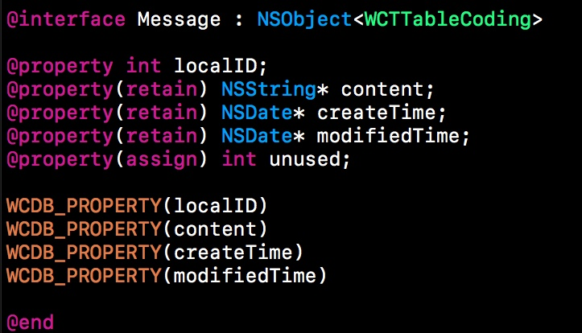

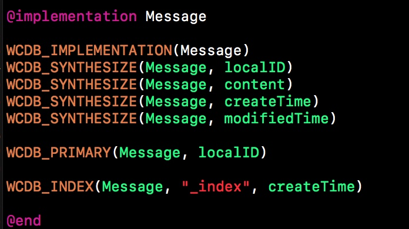

对于一个已有的ObjC类，

* 引用WCDB框架头文件`#import <WCDB/WCDB.h>`，并定义类遵循`WCTTableCoding`协议
* `WCDB_PROPERTY`用于在头文件中声明绑定到数据库表的字段。
* `WCDB_IMPLEMENTATION`，用于在类文件中定义绑定到数据库表的类。同时，该宏内实现了`WCTTableCoding`。因此，开发者无须添加更多的代码来完成`WCTTableCoding`的接口
* `WCDB_SYNTHESIZE`，用于在类文件中定义绑定到数据库表的字段。

简单几行代码，就完成了将类和需要的字段绑定到数据库表的过程。这三个宏在名称和使用习惯上，也都和定义一个ObjC类相似，以此便于记忆。

除此之外，WCDB还提供了许多可选的宏，用于定义数据库索引、约束等，如：

* `WCDB_PRIMARY`用于定义主键
* `WCDB_INDEX`用于定义索引
* `WCDB_UNIQUE`用于定义唯一约束
* `WCDB_NOT_NULL`用于定义非空约束
* ...

定义完成后，只需要调用`createTableAndIndexesOfName:withClass:`接口，即可创建表和索引。

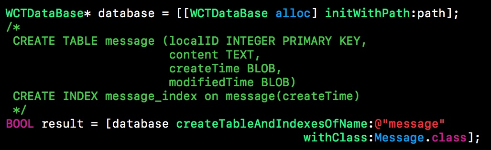

接口会根据ORM的定义，创建对应表和索引。

CRUD
----

得益于ORM的定义，WCDB可以直接进行通过object进行增删改查（CRUD）操作。

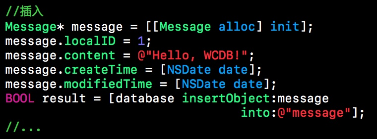

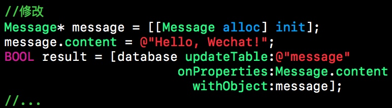

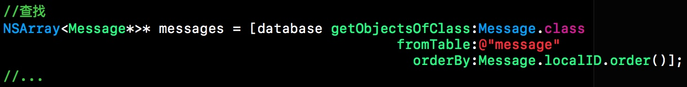

Transaction
-----------

---

WCDB内可通过两种方式执行Transaction（事务），一是`runTransaction:`接口

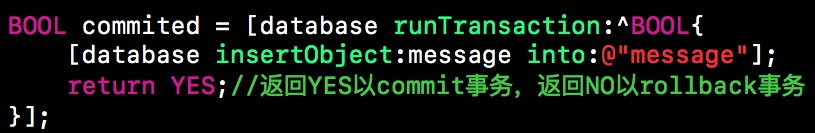

这种方式要求数据库操作在一个BLOCK内完成，简单易用。

另一种方式则是获取`WCTTransaction`对象

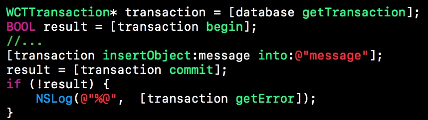

`WCTTransaction`对象可以在类或函数间传递，因此这种方式也更具灵活性。

WINQ
----

有心的同学可能会注意到上述例子中的一些特殊语法：

* `where:Message.localID>0`
* `onProperties:Message.content`
* `orderBy:Message.localID.order(WCTOrderedDescending)`
这个便是WINQ。

WINQ（**W**CDB **In**tegrated **Q**uery，音'wink'），即WCDB集成查询，是将自然查询的SQL集成到WCDB框架中的技术，基于C++实现。

传统的SQL语句，通常是开发者拼接字符串完成。这种方式不仅繁琐、易错，而且出错后很难定位到问题所在。同时也容易给SQL注入留下可乘之机。

而WINQ将查询语言集成到了C++中，可以通过类似函数调用的方式来写SQL查询。借用IDE的代码提示和编译器的语法检查，达到易用、纠错的效果。

对于一个已绑定ORM的类，可以通过`className.propertyName`的方式，获得数据库内字段的映射，以此书写SQL的条件、排序、过滤等等所有语句。如下是几个例子：

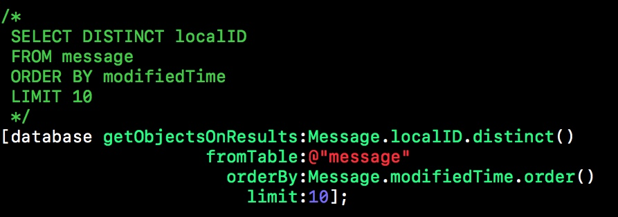

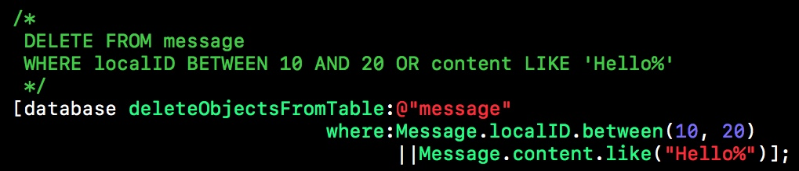

由于WINQ通过接口调用实现SQL查询，因此在书写过程中会有**IDE的代码提示**和**编译器的语法检查**，从而提升开发效率，避免写错。

WINQ的接口包括但不限于：

* 一元操作符：+、-、!等
* 二元操作符：||、&&、+、-、\*、/、|、&、\<\<、\>\>、\<、\<=、==、!=、\>、\>=等
* 范围比较：IN、BETWEEN等
* 字符串匹配：LIKE、GLOB、MATCH、REGEXP等
* 聚合函数：AVG、COUNT、MAX、MIN、SUM等
* ...

凡是SQLite支持的语法规则，WINQ基本都有其对应的接口。且接口名称与SQLite的语法规则基本保持一致。对于熟悉SQL的开发者，无须特别学习即可立刻上手使用。

高级用法
----

---

### as重定向

基于ORM的支持，我们可以从数据库直接取出一个Object。然而，有时候需要取出并非是某个字段，而是有一些组合。例如：

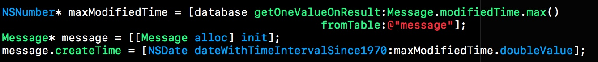

这段代码从数据库中取出了消息的最新的修改时间，并以此将此时间作为消息的创建时间，新建了一个message。这种情况下，就可以使用as重定向。

as重定向，它可以将一个查询结果重定向到某一个字段，如下：

通过`as(Message.createTime)`的语法，将查询结构重新指向了createTime。因此只需一行代码便可完成原来的任务。

### 链式调用

链式调用是指对象的接口返回一个对象，从而允许在单个语句中将调用链接在一起，而不需要变量来存储中间结果。

WCDB对于增删改查操作，都提供了对应的类以实现链式调用

* WCTInsert
* WCTDelete
* WCTUpdate
* WCTSelect
* WCTRowSelect
* WCTMultiSelect

`where`、`orderBy`、`limit`等接口的返回值均为self，因此可以通过链式调用，更自然更灵活的写出对应的查询。

传统的接口方便快捷，可以直接获得操作结果；链式接口则更具灵活性，开发者可以获取数据库操作的耗时、错误信息；也可以通过遍历逐个生成object。

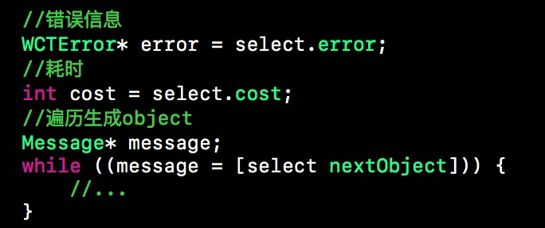

WCDB内同时支持这两种接口，优势互补，开发者可以根据需求，选择使用。

### 多表查询

SQLite支持联表查询，在某些特定的场景下，可以起到优化性能、简化表结构的作用。

WCDB同样提供了对应的接口，并在ORM的支持下，通过`WCTMultiSelect`的链式接口，可以同时从表中取出多个类的对象。

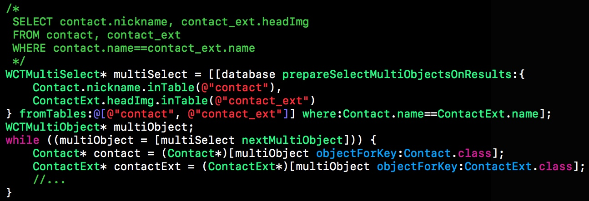

### 类字段绑定

在ORM中，我们通过宏，将ObjC类的property绑定为数据库的一个字段。但并非所有property的类型都能绑定到字段。

WCDB内置支持的类型有：

* const char\*的C字符串类型
* 包括但不限于`int`、`unsigned`、`long`、`unsigned long`、`long long`、`unsigned long long`等所有基于整型的C基本类型
* 包括但不限于`float`、`double`、`long double`等所有基于浮点型的C基本类型
* enum及所有基于枚举型的C基本类型
* `NSString`、`NSMutableString`
* `NSData`、`NSMutableData`
* `NSArray`、`NSMutableArray`
* `NSDictionary`、`NSMutableDictionary`
* `NSSet`、`NSMutableSet`
* `NSValue`
* `NSDate`
* `NSNumber`
* `NSURL`

然而，内置支持得再多，也不可能完全覆盖开发者所有的需求。

因此WCDB支持开发者自定义类字段绑定。类只需实现`WCTColumnCoding`协议，即可支持绑定。

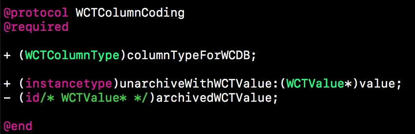

* `columnTypeForWCDB`接口定义类对应数据库中的类型
* `unarchiveWithWCTValue:`接口定义从数据库类型反序列化到类的转换方式
* `archivedWCTValue`接口定义从类序列化到数据库类型的转换方式

为了简化定义，WCDB提供了文件模版来创建类字段绑定。

首先需要安装文件模版。该模版的安装脚本集成在WCDB的编译脚本中，只需编译一次WCDB，就会自动安装文件模版。安装完成后重启Xcode，新建文件，即可看到对应的文件模版

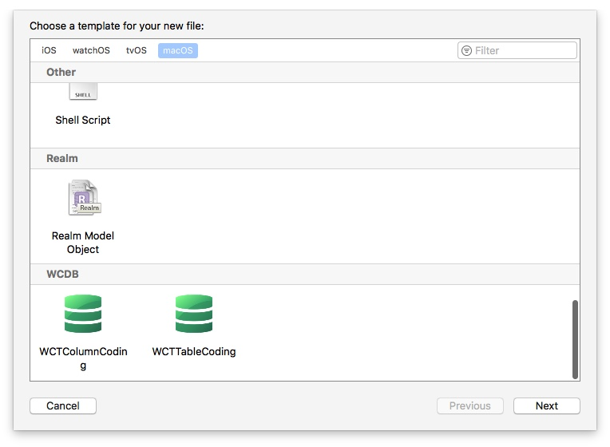

选择WCTColumnCoding

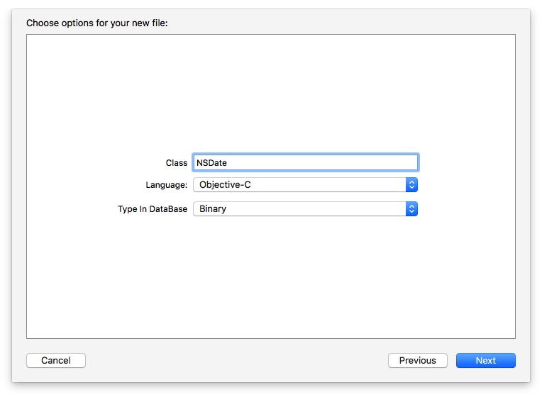

* Class：需要进行字段绑定的类，这里以`NSDate`为例
* Language：WCDB支持绑定ObjC类和C++类，这里选择Objective-C
* Type In DataBase：类对应数据库中的类型。包括
  * WCTColumnTypeInteger32
  * WCTColumnTypeInteger64
  * WCTColumnTypeDouble
  * WCTColumnTypeString
  * WCTColumnTypeBinary

我们知道`NSDate`是遵循`NSCoding`协议的，因此这里选择了Binary类型。即，将NSDate以二进制数据的形式存到数据库中。完成后会自动创建如下的文件模版：

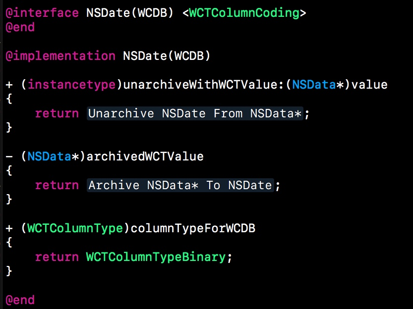

然后只需将NSDate和NSData互相转换的方式填上去即可。如下：

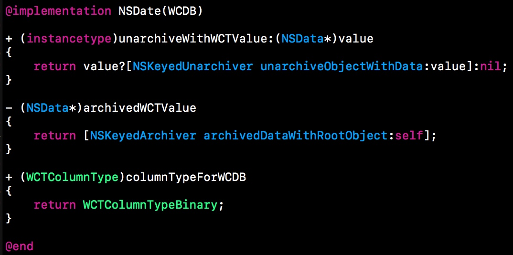

总结
==

WCDB通过ORM和WINQ，体现了其易用性上的优势，使得数据库操作不再繁杂。同时，通过链式调用，开发者也能够方便地获取数据库操作的耗时等性能信息。而高级用法则扩展了WCDB的功能和用法。

由于篇幅所限，本文只介绍了WCDB最表层的功能。该系列接下来还将深入介绍WCDB的架构和原理，分享WCDB高并发的解决方案、WINQ实现中的思考等等。敬请期待！