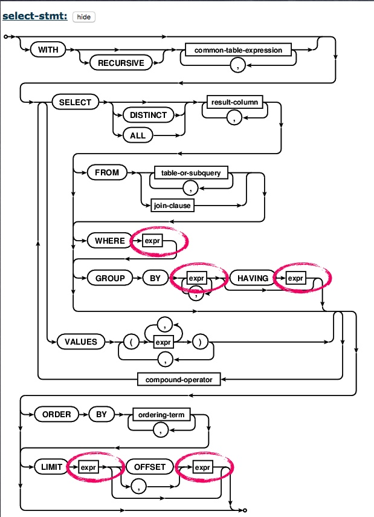
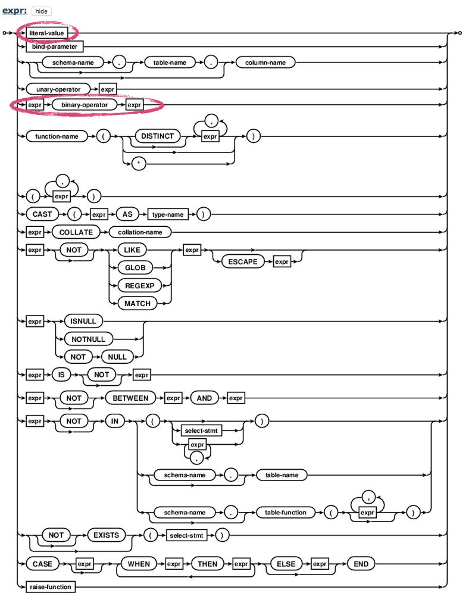
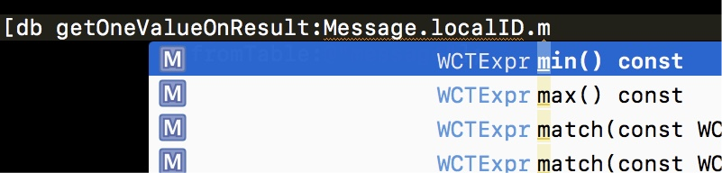
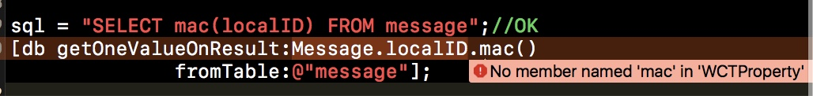

背景
==

高效、完整、易用是WCDB的基本原则。前几篇文章分享了WCDB的基本用法和修复工具，接下来将更深入地聊聊WCDB在易用性上的思考和实践。

对于各类客户端数据库，似乎都绕不开拼接字符串这一步。即便在Realm这样的NoSQL的数据库中，在进行查询时，也依赖于字符串的语法：

```c
//Realm code
[Dog objectsWhere:@"age < 2"]
```

别看小小的字符串拼接，带来的麻烦可不小：

* 代码冗余。为了拼接出匹配的SQL语句，业务层往往要写许多胶水代码来format字符串。这些代码冗长且没有什么“营养”。
* 难以查错。对于编译器而言，SQL只是一个字符串。这就意味着即便你只写错了一个字母，也得在代码run起来之后，通过log或断点才能发现错误。倘若SQL所在的代码文件依赖较多，即使改正一个敲错的字母，就得将整个工程重新编译一遍，简直是浪费生命。
* SQL注入。举一个简单的例子：

```objc
- (BOOL)insertMessage:(NSString*)message
{
    NSString* sql = [NSString stringWithFormat:@"INSERT INTO message VALUES('%@')", message];
    return [db executeUpdate:sql];
}
```

这是插入消息的SQL。倘若对方发来这样的消息：`');DELETE FROM message;--`，那么这个插入的SQL就会被分成三段进行解析：

```sql
INSERT INTO message VALUES('');
DELETE FROM message;
--')
```

它会在插入一句空消息后，将message表内的所有消息删除。若App内存在这样的漏洞被坏人所用，后果不堪设想。

反注入的通常做法是，

* 利用SQLite的绑定参数。通过绑定参数避免字符串拼接。

```objc
- (BOOL)insertMessage:(NSString*)message
{
    return [db executeUpdate:@"INSERT INTO message VALUES(?)", message];
}
```

* 对于不适用绑定参数的SQL，则可以将单引号替换成双单引号，避免传入的单引号提前截断SQL。

```objc
- (BOOL)insertMessage:(NSString*)message
{
    NSString* sql = [NSString stringWithFormat:@"INSERT INTO message VALUES('%@')", [message stringByReplacingOccurrencesOfString:@"'" withString:@"''"]];
    return [db executeUpdate:sql];
}
```

尽管反注入并不难，但要求业务开发都了解、并且在开发过程中时时刻刻都警惕着SQL注入，是不现实的。

一旦错过了在框架层统一解决这些问题的机会，后面再通过代码规范、Code Review等等人为的方式去管理，就难免会发生疏漏。

因此，WCDB的原则是，问题应当更早发现更早解决。

* 能在编译期发现的问题，就不要拖到运行时；
* 能在框架层解决的问题，就不要再让业务去分担。

基于这个原则，我开始进行对SQLite的接口的抽象。

SQL的组合能力
========

思考的过程注定不会是一片坦途，我遇到的第一个挑战就是：

### 问题一：SQL应该怎么抽象？

SQL是千变万化的，它可以是一个很简单的查询，例如：

```sql
SELECT * FROM message;
```

这个查询只是取出message表中的所有元素。假设我们可以封装成接口：

```c
StatementSelect getAllFromTable(const char* tableName);
```

但SQL也可以是一个很复杂的查询，例如：

```sql
SELECT max(localID), count(content) FROM message
WHERE content IS NOT NULL 
    AND createTime!=modifiedTime 
    OR type NOT BETWEEN 0 AND 2
GROUP BY type
HAVING localID>0
ORDER BY createTime ASC
LIMIT (SELECT count(*) FROM contact, contact_ext
	   WHERE contact.username==contact_ext.username)
```

这个查询包含了条件、分组、分组过滤、排序、限制、聚合函数、子查询，多表查询。什么样的接口才能兼容这样的SQL？

遇到这种两极分化的问题，我的思路通常是二八原则。即

* 封装常用操作，覆盖80%的使用场景。
* 暴露底层接口，适配剩余20%的特殊情况。

但更多的问题出现：

### 问题二：怎么定义常用操作？

* 对于微信常用的操作，是否也适用于所有开发者？
* 现在不使用的操作，以后是否会变成常用？

### 问题三：常用操作与常用操作的组合，是否仍属于常用操作？

查询某个字段的最大值或最小值，应该属于常用操作的：

```sql
SELECT max(localID) FROM message;
SELECT min(localID) FROM message;
```

假设可以封装为

```c
StatementSelect getMaxOfColumnFromTable(const char* columnName, const char* tableName);
StatementSelect getMinOfColumnFromTable(const char* columnName, const char* tableName);
```

但，SQL是存在组合的能力的。同时查询最大值和最小值，是否仍属于常用操作？

```sql
SELECT max(localID), min(localID) FROM message;
```

若以此规则，继续封装为：

```c
StatementSelect getMaxAndMinOfColumnFromTable(const char* columnName, const char* tableName);
```

那同时查询最大值、最小值和总数怎么办？

```sql
SELECT max(localID), min(localID), count(localID) FROM message;
```

显然，“常用接口”的定义在不断地扩大，接口的复杂性也在增加。以后维护起来，就会疲于加新接口，并且没有边界。

### 问题四：特殊场景所暴露的底层接口，应该以什么形式存在？

若底层接口还是接受字符串参数的传入，那么前面所思考的一切都是徒劳。


因此，这里就需要一个理论的基础，去支持WCDB封装是合理的，而不仅仅是堆砌接口。

于是，我就去找了SQL千变万化组合的根源 --- SQL语法规则。

SQL语法规则
=======

SQLite官网提供了SQL的语法规则：<http://www.sqlite.org/lang.html>

例如，这是一个`SELECT`语句的语法规则：



SQLite按照图示箭头流向的语法规则解析传入的SQL字符串。每个箭头都有不同的流向可选。

例如，`SELECT`后，可以直接接`result-column`，也可以插入`DISTINCT`或者`ALL`。

语法规则中的每个字段都有其对应涵义，其中

* `SELECT`、`DISTINCT`、`ALL`等等大写字母是`keyword`，属于SQL的保留字。
* `result-column、``table-or-subquery`、`expr`等等小写字母是token。token可以再进一步地展开其构成的语法规则。

例如，在`WHERE`、`GROUP BY`、`HAVING`、`LIMIT`、`OFFSET`后所跟的参数都是`expr`，它的展开如下：



可以看到，`expr`有很多种构成方式，例如：

* `expr`: `literal-value`。`literal-value`可以进一步展开，它是纯粹的数值。
  * 如数字1、数字30、字符串"Hello"等都是`literal-value`，因此它们也是`expr`。
* `expr`: `expr (binary operator) expr`。两个`expr`通过二元操作符进行连接，其结果依然属于`expr`。
  * 如1+"Hello"。1和"Hello"都是`literal-value`，因此它们都是`expr`，通过二元操作符"+"号连接，其结果仍然是一个`expr`。尽管1+"Hello"看上去没有实质的意义，但它仍是SQL正确的语法。

以刚才那个复杂的SQL中的查询语句为例：

```sql
content IS NOT NULL 
AND createTime!=modifiedTime 
OR type NOT BETWEEN 0 AND 2
```

1. `content IS NOT NULL`，符合 `expr IS NOT NULL`的语法，因此其可以归并为`expr`
2. `createTime!=modifiedTime`，符合 `expr (binary operator) expr`的语法，因此其可以归并为`expr`
3. `type NOT BETWEEN 0 AND 2`，符合 `expr NOT BETWEEN expr AND expr`的语法，因此其可以归并为`expr`
4. `1. AND 2.`，符合`expr (binary operator) expr`的语法，因此其可以归并为`expr`
5. `4. OR 3.`，符合`expr (binary operator) expr`的语法，因此其可以归并为`expr`

最终，这么长的条件语句归并为了一个`expr`，符合`SELECT`语法规则中`WHERE expr`的语法，因此是正确的SQL条件语句。

也正是基于此，可以得出：只要按照SQL的语法封装，就可以保留其组合的能力，就不会错过任何接口，落入疲于加接口的陷阱。

WCDB的具体做法是：

1. 将固定的keyword，封装为函数名，作为连接。
2. 将可以展开的token，封装为类，并在类内实现其不同的组合。

以SELECT语句为例：

```c
class StatementSelect : public Statement {
public:
    //...
    StatementSelect &where(const Expr &where);
    StatementSelect &limit(const Expr &limit);
    StatementSelect &having(const Expr &having);
    //...
};
```

在语法规则中，`WHERE`、`LIMIT`等都接受`expr`作为参数。因此，不管SQL多么复杂，`StatementSelect`也只接受`Expr`的参数。而其组合的能力，则在`Expr`类内实现。

```c
class Expr : public Describable {
public:
    Expr(const Column &column);
    template <typename T>
    Expr(const T &value,
         typename std::enable_if<std::is_arithmetic<T>::value ||
                                 std::is_enum<T>::value>::type * = nullptr)
        : Describable(literalValue(value))
    {
    }
    Expr(const std::string &value);

    Expr operator||(const Expr &operand) const;
    Expr operator&&(const Expr &operand) const;
    Expr operator!=(const Expr &operand) const;

    Expr between(const Expr &left, const Expr &right) const;
    Expr notBetween(const Expr &left, const Expr &right) const;

    Expr isNull() const;
    Expr isNotNull() const;
    
    //...
};
```

`Expr`通过构造函数和C++的偏特化模版，实现了从字符串和数字等进行初始化的效果。同时，通过C++运算符重载的特性，可以将SQL的运算符无损地移植到过来，使得语法上也可以更接近于SQL。

在对应函数里，再进行SQL的字符串拼接即可。同时，所有传入的字符串都会在这一层预处理，以防注入。如：

```c
Expr::Expr(const std::string &value) : Describable(literalValue(value))
{
}

std::string Expr::literalValue(const std::string &value)
{
  //SQL anti-injection
    return "'" + stringByReplacingOccurrencesOfString(value, "'", "''") + "'";
}

Expr Expr::operator&&(const Expr &operand) const
{
    Expr expr;
    expr.m_description.append("(" + m_description + " AND " +
                              operand.m_description + ")");
    return expr;
}
```

基于这个抽象方式，就可以对复杂查询中的条件语句进行重写为：

```c
Column content("content");
Column createTime("createTime");
Column modifiedTime("modifiedTime");
Column type("type");
StatementSelect select;
//...
//WHERE content IS NOT NULL 
//      AND createTime!=modifiedTime 
//      OR type NOT BETWEEN 0 AND 2
select.where(Expr(content).isNotNull()
            &&Expr(createTime)!=Expr(modifiedTime)
            ||Expr(type).notBetween(0, 2));
//...
```

首先通过`Column`创建对应数据库字段的映射，再转换为`Expr`，调用对应封装的函数或运算符，即可完成字符串拼接操作。

这个抽象便是WCDB的语言集成查询的特性 --- WINQ（**W**CDB **In**tegrated **Q**uery）。


更进一步，由于WCDB在接口层的ORM封装，使得开发者可以直接通过`className.propertyName`的方式，拿到字段的映射。因此连上述的转换操作也可以省去，查询代码可以在一行代码内完成。

以下是WCDB在接口层和WINQ的支持下，对前面所提到的SQL语句的代码示例：

```objc
//SELECT * FROM message;
[db getAllObjectsOfClass:Message.class
               fromTable:@"message"];

/*
 SELECT max(localID), count(content) 
 FROM message
 WHERE content IS NOT NULL 
    AND createTime!=modifiedTime 
    OR type NOT BETWEEN 0 AND 2
 GROUP BY type
 HAVING localID>0
 ORDER BY createTime ASC
 LIMIT (SELECT count(*) 
        FROM contact, contact_ext
        WHERE contact.username==contact_ext.username)
 */
[[[[[[db prepareSelectRowsOnResults:{Message.localID.max(), Message.content.count()}
                          fromTable:@"message"]
                              where:Message.content.isNotNull() 
                                    && Message.createTime != Message.modifiedTime 
                                    || Message.type.notBetween(0, 2)]
                            groupBy:{Message.type}]
                             having:Message.localID > 0]
                            orderBy:Message.createTime.order(WCTOrderedAscending)]
                              limit:[[[WCTSelectBase alloc] initWithResultList:Contact.AnyProperty.count()
                                                                    fromTables:@[ @"contact", @"contact_ext" ]]
                                                                         where:Contact.username.inTable(@"contact") == ContactExt.username.inTable(@"contact_ext")]];

/*
 SELECT max(localID) FROM message;
 */
[db getOneValueOnResult:Message.localID.max()
              fromTable:@"message"];
/*
 SELECT min(localID) FROM message;
 */
[db getOneValueOnResult:Message.localID.min()
              fromTable:@"message"];
/*
 SELECT max(localID), min(localID) FROM message;
 */
[db getOneRowOnResults:{Message.localID.max(), Message.localID.min()}
             fromTable:@"message"];
/*
 SELECT max(localID), min(localID), count(localID) FROM message
 */
[db getOneRowOnResults:{Message.localID.max(), Message.localID.min(), Message.localID.count()}
             fromTable:@"message"];
```

总结
==

WCDB通过WINQ抽象SQLite语法规则，使得开发者可以告别字符串拼接的胶水代码。通过和接口层的ORM结合，使得即便是很复杂的查询，也可以通过一行代码完成。并借助IDE的代码提示和编译检查的特性，大大提升了开发效率。同时还内建了反注入的保护。



代码提示



编译时检查

虽然WINQ在实现上使用了C++11特性和模版等，但在使用过程并不需要涉及。对于熟悉SQL的开发，只需按照本能即可写出SQL对应的WINQ语句。最终达到提高WCDB易用性的目的。

同时，基于C++的实现也使得WINQ在性能可以期待。

后续我们还将分享WCDB在多线程管理上的思考。开发者也可以点击阅读原文访问WCDB的Github仓库，先睹为快！

