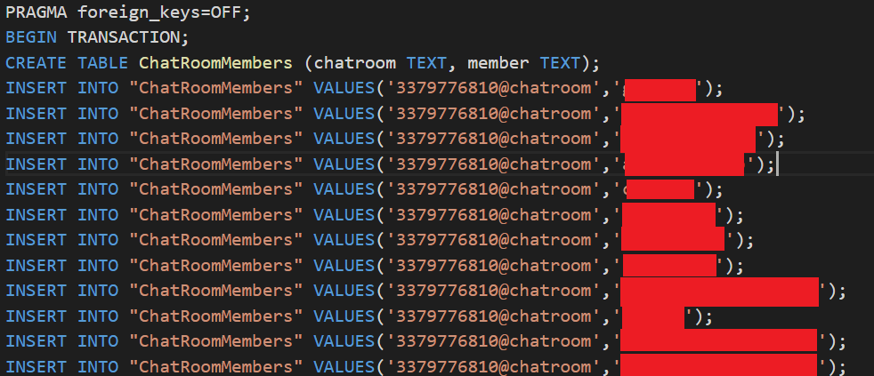
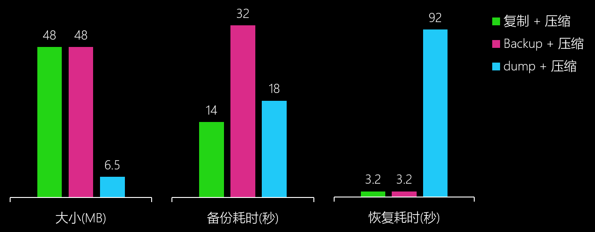
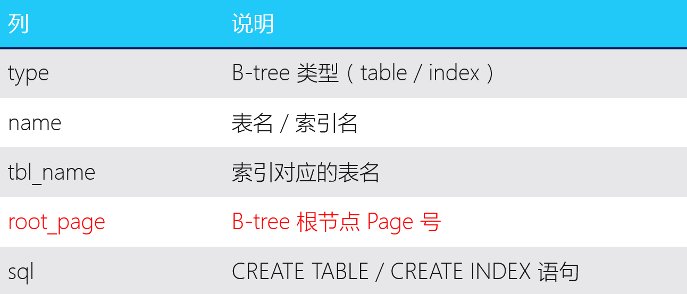
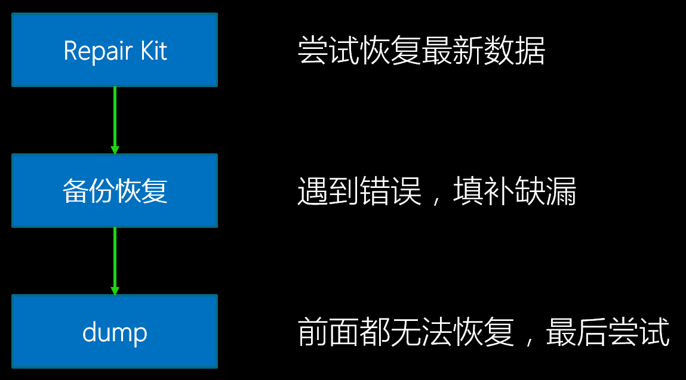

# 微信移动端数据库组件WCDB系列（二） — 数据库修复三板斧

## 前言

长久以来SQLite DB都有损坏问题，从Android、iOS等移动系统，到Windows、Linux
等桌面系统都会出现。由于微信所有消息都保存在DB，服务端不保留备份，一旦损坏将导致用户
消息被清空，显然不能接受。

我们即将开源的移动数据库组件 WCDB (WeChat Database)，致力于解决 DB 损坏导致数据丢失的问题。

之前的一篇文章《微信 SQLite 数据库修复实践》介绍了微信对SQLite数据库修复
以及降低损坏率的实践，这次再深入介绍一下微信数据库修复的具体方案和发展历程。

## 我们的需求

具体来说，微信需要一套满足以下条件的DB恢复方案：

  * **恢复成功率高。** 由于牵涉到用户核心数据，“姑且一试”的方案是不够的，虽说 100%
    成功率不太现实，但 90% 甚至 99% 以上的成功率才是我们想要的。
  * **支持加密DB。** Android 端微信客户端使用的是加密 SQLCipher DB，加密会改变信息
    的排布，往往对密文一个字节的改动就能使解密后一大片数据变得面目全非。这对于数据恢复
    不是什么好消息，我们的方案必须应对这种情况。
  * **能处理超大的数据量。** 经过统计分析，个别重度用户DB大小已经超过2GB，恢复方案
    必须在如此大的数据量下面保证不掉链子。
  * **不影响体验。** 统计发现只有万分之一不到的用户会发生DB损坏，如果恢复方案
    需要事先准备（比如备份），它必须对用户不可见，不能为了极个别牺牲全体用户的体验。

经过多年的不断改进，微信先后采用出三套不同的DB恢复方案，离上面的目标已经越来越近了。

## 官方的Dump恢复方案

Google 一下SQLite DB恢复，不难搜到使用`.dump`命令恢复DB的方法。`.dump`命令的作用是将
整个数据库的内容输出为很多 SQL 语句，只要对空 DB 执行这些语句就能得到一个一样的 DB。

`.dump`命令原理很简单：每个SQLite DB都有一个`sqlite_master`表，里面保存着全部table
和index的信息（table本身的信息，不包括里面的数据哦），遍历它就可以得到所有表的名称和
`CREATE TABLE ...`的SQL语句，输出`CREATE TABLE`语句，接着使用`SELECT * FROM ...`
通过表名遍历整个表，每读出一行就输出一个`INSERT`语句，遍历完后就把整个DB dump出来了。
这样的操作，和普通查表是一样的，遇到损坏一样会返回`SQLITE_CORRUPT`，我们忽略掉损坏错误，
继续遍历下个表，最终可以把所有没损坏的表以及**损坏了的表的前半部分**读取出来。将dump
出来的SQL语句逐行执行，最终可以得到一个等效的新DB。由于直接跑在SQLite上层，所以天然
就支持加密SQLCipher，不需要额外处理。

（图：dump输出样例）

这个方案不需要任何准备，只有坏DB的用户要花好几分钟跑恢复，大部分用户是不感知的。
数据量大小，主要影响恢复需要的临时空间：先要保存dump 出来的SQL的空间，这个
大概一倍DB大小，还要另外一倍 DB大小来新建 DB恢复。至于我们最关心的成功率呢？上线后，
**成功率约为30%**。这个成功率的定义是至少恢复了一条记录，也就是说一大半用户
一条都恢复不成功！

研究一下就发现，恢复失败的用户，原因都是`sqlite_master`表读不出来，特别是第一页损坏，
会导致后续所有内容无法读出，那就完全不能恢复了。恢复率这么低的尴尬状况维持了好久，
其他方案才渐渐露出水面。

## 备份恢复方案

损坏的数据无法修复，最直观的解决方案就是备份，于是备份恢复方案被提上日程了。备份恢复这个
方案思路简单，SQLite 也有不少备份机制可以使用，具体是：

  * **拷贝：** 不能再直白的方式。由于SQLite DB本身是文件（主DB + journal 或 WAL），
    直接把文件复制就能达到备份的目的。
  * **Dump：** 上一个恢复方案用到的命令的本来目的。在DB完好的时候执行`.dump`，
    把 DB所有内容输出为 SQL语句，达到备份目的，恢复的时候执行SQL即可。
  * **Backup API：** SQLite自身提供的一套备份机制，按 Page 为单位复制到新 DB，
    支持热备份。

这么多的方案孰优孰劣？作为一个移动APP，我们关心的无非就是 **备份大小、备份性能、
恢复性能** 几个指标。微信作为一个重度DB使用者，备份大小和备份性能是主要关注点，
原本用户就可能有2GB 大的 DB，如果备份数据本身也有2GB 大小，用户想必不会接受；
性能则主要影响体验和备份成功率，作为用户不感知的功能，占用太多系统资源造成卡顿
是不行的，备份耗时越久，被系统杀死等意外事件发生的概率也越高。

对以上方案做简单测试后，备份方案也就基本定下了。测试用的DB大小约 **50MB**，
数据条目数大约为 **10万条**：

可以看出，比较折中的选择是 **Dump + 压缩**，备份大小具有明显优势，备份性能尚可，
恢复性能较差但由于需要恢复的场景较少，算是可以接受的短板。

微信在Dump + gzip方案上再加以优化，由于格式化SQL语句输出耗时较长，因此使用了自定义
的二进制格式承载Dump输出。第二耗时的压缩操作则放到别的线程同时进行，在双核以上的环境
基本可以做到无额外时间消耗。由于数据保密需要，二进制Dump数据也做了加密处理。
采用自定义二进制格式还有一个好处是，恢复的时候不需要重复的编译SQL语句，编译一次就可以
插入整个表的数据了，恢复性能也有一定提升。优化后的方案比原始的Dump + 压缩，
**每秒备份行数提升了 150%，每秒恢复行数也提升了 40%**。

即使优化后的方案，对于特大DB备份也是耗时耗电，对于移动APP来说，可能未必有这样的机会
做这样重度的操作，或者频繁备份会导致卡顿，这也是需要开发者衡量的。比如Android微信会
选择在 **充电并灭屏** 时进行DB备份，若备份过程中退出以上状态，备份会中止，等待下次机会。

备份方案上线后，恢复成功率**达到72%**，但有部分重度用户DB损坏时，由于备份耗时太久，
始终没有成功，而对DB数据丢失更为敏感的也恰恰是这些用户，于是新方案应运而生。

## 解析B-tree恢复方案（RepairKit）

备份方案的高消耗迫使我们从另外的方案考虑，于是我们再次把注意力放在之前的Dump方案。
Dump 方案本质上是尝试从坏DB里读出信息，这个尝试一般来说会出现两种结果：

  * DB的基本格式仍然健在，但个别数据损坏，读到损坏的地方SQLite返回`SQLITE_CORRUPT`错误，
    但已读到的数据得以恢复。
  * 基本格式丢失（文件头或`sqlite_master`损坏），获取有哪些表的时候就返回`SQLITE_CORRUPT`，
    根本没法恢复。

第一种可以算是预期行为，毕竟没有损坏的数据能 **部分恢复**。从之前的数据看，
不少用户遇到的是第二种情况，这种有没挽救的余地呢？

要回答这个问题，先得搞清楚`sqlite_master`是什么。它是一个每个SQLite DB都有的特殊的表，
无论是查看官方文档[Database File Format][sqlite-format]，还是执行SQL语句
`SELECT * FROM sqlite_master;`，都可得知这个系统表保存以下信息： 表名、类型（table/index）、
创建此表/索引的SQL语句，以及表的RootPage。`sqlite_master`的表名、表结构都是固定的，
由文件格式定义，RootPage 固定为 page 1。*

（图：sqlite_master表）

正常情况下，SQLite 引擎打开DB后首次使用，需要先遍历`sqlite_master`，并将里面保存的SQL语句再解析一遍，
保存在内存中供后续编译SQL语句时使用。假如`sqlite_master`损坏了无法解析，“Dump恢复”这种走正常SQLite
流程的方法，自然会卡在第一步了。为了让`sqlite_master`受损的DB也能打开，需要想办法绕过SQLite引擎的逻辑。
由于SQLite引擎初始化逻辑比较复杂，为了避免副作用，没有采用hack的方式复用其逻辑，而是决定仿造一个只可以
读取数据的最小化系统。

虽然仿造最小化系统可以跳过很多正确性校验，但`sqlite_master`里保存的信息对恢复来说也是十分重要的，
特别是RootPage，因为它是表对应的B-tree结构的根节点所在地，没有了它我们甚至不知道从哪里开始解析对应的表。

`sqlite_master`信息量比较小，而且只有改变了表结构的时候（例如执行了`CREATE TABLE`、`ALTER TABLE`
等语句）才会改变，因此对它进行备份成本是非常低的，一般手机典型只需要几毫秒到数十毫秒即可完成，一致性也容易保证，
只需要执行了上述语句的时候重新备份一次即可。有了备份，我们的逻辑可以在读取DB自带的`sqlite_master`失败的时候
使用备份的信息来代替。

DB初始化的问题除了文件头和`sqlite_master`完整性外，还有加密。SQLCipher加密数据库，对应的恢复逻辑还需要加上
解密逻辑。按照SQLCipher的实现，加密DB 是按page 进行包括头部的完整加密，所用的密钥是根据用户输入的原始密码和
创建DB 时随机生成的 salt 运算后得出的。可以猜想得到，如果保存salt错了，将没有办法得出之前加密用的密钥，
导致所有page都无法读出了。由于salt 是创建DB时随机生成，后续不再修改，将它纳入到备份的范围内即可。

到此，初始化必须的数据就保证了，可以仿造读取逻辑了。我们常规使用的读取DB的方法（包括dump方式恢复），
都是通过执行SQL语句实现的，这牵涉到SQLite系统最复杂的子系统——SQL执行引擎。我们的恢复任务只需要遍历B-tree所有节点，
读出数据即可完成，不需要复杂的查询逻辑，因此最复杂的SQL引擎可以省略。同时，因为我们的系统是只读的，
写入恢复数据到新 DB 只要直接调用 SQLite 接口即可，因而可以省略同样比较复杂的B-tree平衡、Journal和同步等逻辑。
最后恢复用的最小系统只需要：

  * VFS读取部分的接口（Open/Read/Close），或者直接用stdio的fopen/fread、Posix的open/read也可以
  * SQLCipher的解密逻辑
  * B-tree解析逻辑

即可实现。

（图：最小化系统）

[Database File Format][sqlite-format] 一文详细描述了SQLite文件格式，
参照之实现B-tree解析可读取 SQLite DB。加密 SQLCipher 情况较为复杂，幸好SQLCipher
加密部分可以单独抽出，直接套用其解密逻辑。

实现了上面的逻辑，就能读出DB的数据进行恢复了，但还有一个小插曲。我们知道，使用SQLite查询一个表，
每一行的列数都是一致的，这是Schema层面保证的。但是在Schema的下面一层——B-tree层，没有这个保证。
B-tree的每一行（或者说每个entry、每个record）可以有不同的列数，一般来说，SQLite插入一行时，
B-tree里面的列数和实际表的列数是一致的。但是当对一个表进行了`ALTER TABLE ADD COLUMN`操作，
整个表都增加了一列，但已经存在的B-tree行实际上没有做改动，还是维持原来的列数。
当SQLite查询到`ALTER TABLE`前的行，缺少的列会自动用默认值补全。恢复的时候，也需要做同样的判断和支持，
否则会出现缺列而无法插入到新的DB。

解析B-tree方案上线后，**成功率约为78%**。这个成功率计算方法为恢复成功的 Page 数除以总 Page 数。
由于是我们自己的系统，可以得知总 Page 数，使用恢复 Page 数比例的计算方法比人数更能反映真实情况。
B-tree解析好处是准备成本较低，不需要经常更新备份，对大部分表比较少的应用备份开销也小到几乎可以忽略，
成功恢复后能还原损坏时最新的数据，不受备份时限影响。
坏处是，和Dump一样，如果损坏到表的中间部分，比如非叶子节点，将导致后续数据无法读出。

## 不同方案的组合

由于解析B-tree恢复原理和备份恢复不同，失败场景也有差别，可以两种手段混合使用覆盖更多损坏场景。
微信的数据库中，有部分数据是临时或者可从服务端拉取的，这部分数据可以选择不修复，有些数据是不可恢复或者
恢复成本高的，就需要修复了。

如果修复过程一路都是成功的，那无疑使用B-tree解析修复效果要好于备份恢复。备份恢复由于存在
时效性，总有部分最新的记录会丢掉，解析修复由于直接基于损坏DB来操作，不存在时效性问题。
假如损坏部分位于不需要修复的部分，解析修复有可能不发生任何错误而完成。

若修复过程遇到错误，则很可能是需要修复的B-tree损坏了，这会导致需要修复的表发生部分或全部缺失。
这个时候再使用备份修复，能挽救一些缺失的部分。

最早的Dump修复，场景已经基本被B-tree解析修复覆盖了，若B-tree修复不成功，Dump恢复也很有可能不会成功。
即便如此，假如上面的所有尝试都失败，最后还是会尝试Dump恢复。

上面说的三种修复方法，原理上只涉及到SQLite文件格式以及基本的文件系统，是跨平台的。
实际操作上，各个平台可以利用各自的特性做策略上的调整，比如 Android 系统使用 `JobScheduler`
在充电灭屏状态下备份。

## 我们的组件

WCDB - WeChat Database，微信的移动数据库组件，包含上面几种修复方案，
以及加密、连接池并发、ORM、性能优化等特性，将在近日开源，欢迎关注。

[dump-example]: http://stackoverflow.com/questions/18259692/how-to-recover-a-corrupt-sqlite3-database
[sqlite-format]: http://sqlite.org/fileformat2.html
