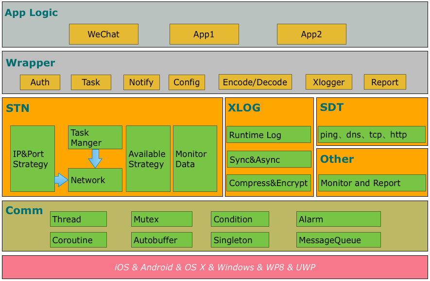

##背景
2012 年中，微信支持包括 Android、iOS、Symbian 等三个平台。但在各个平台上，微信客户端没有任何统一的基础模块。2012 年的微信正处于高速发展时期，各平台的迭代速度不一、使用的编程语言各异，后台架构也处在不断探索的过程中。多种因素使得各个平台基础模块的实现出现了差异，导致出现多次需要服务器做兼容的善后工作。网络作为微信的基础，重要性不言而喻。任何网络实现的 bug 都可能导致重大事故。例如微信的容灾实现，如果因为版本的实现差异，导致某些版本上无法进行容灾恢复，将会严重的影响用户体验，甚至造成用户的流失。我们急需一套统一的网络基础库，为微信的高速发展保驾护航。

恰好，这个时候塞班渐入日暮，微信对塞班的支持也逐渐减弱。老大从塞班组抽调人力，组成一个三人小 team 的初始团队，开始着手做通用的基础组件。这个基础组件最初就定位为：跨平台、跨业务的基础组件。现在看，这个组件除了解决了已有问题，还给微信的高速发展带来了很多优势，例如：
* 基础组件方便了开展专项的网络基础研究与优化。
* 基础组件为多平台的快速实现提供了有力的支持。

经过四年多的发展，跨平台的基础组件已经包含了网络组件、日志组件在内的多个组件。回头看，这是一条开荒路。

##设计原则
在基础模块的开发中，设计尤为重要。在设计上，微信基础组件以跨平台、跨业务为前提，遵从**高可用，高性能，负载均衡**的设计原则。

可用是一个即时通讯类 App 的立身之本。高可用又体现在多个层面上：网络的可用性、 App 的可用性、系统的可用性等。

* 网络的可用性  
移动互联网有着丢包率高、带宽受限、延迟波动、第三方影响等特点，使得网络的可用性，尤其是弱网络下的可用性变得尤为关键。Mars 的 STN 组件作为基于 socket 层的网络解决方案，在很多细节设计上会充分考虑弱网络下的可用性。

* App 的可用性  
App 的可用性包含稳定性、运行性能等多个方面。文章[高性能日志模块 xlog](https://mp.weixin.qq.com/s/cnhuEodJGIbdodh0IxNeXQ) 描述了 xlog 在不影响 App 运行性能的前提下进行的大量设计思考。

* 系统的可用性  
除了考虑正常的使用场景，APP的设计还需要从整个系统的角度进行设计思考。例如在容灾设计上，Mars 不仅使用了服务器容灾方案，也设计了客户端的本地容灾。当部分服务器出灾时，目前微信可以做到，15min 内把95%以上的用户转移到可用服务器上。

保障高可用并不代表可以牺牲性能，对于一个用户使用最频繁的应用，反而更要对使用的资源精打细算。例如在 [Mars 信令传输超时设计](https://mp.weixin.qq.com/s/PnICVDyVuMSyvpvTrdEpSQ)中，多级超时的设计充分的考虑了可用性与高性能之间的平衡取舍。

如果说高可用高性能只是客户端本身的考虑的话，负载均衡就需要结合服务器端来考虑了，做一个客户端网络永远不能只把眼光放在客户端上。任何有关网络访问的决策都要考虑给服务器所带来的额外压力是多大。为了选用质量较好的 IP，曾经写了完整的客户端测速代码，后来删掉，其中一个原因是因为不想给服务器带来额外的负担。Mars 的代码中，选择 IP 时用了大量的随机函数也是为了规避大量的用户同时访问同一台服务器而做的。

在这四年，我学到最多的就是简单和平衡。 把方案做的尽可能简单，这样才不容易出错。设计方案时大多数时候都不可能满足所有想达到的条件，这个时候就需要去平衡各个因素。在组件中一个很好的例子就是长连接的连接频率(具体实现见longlink_connect_monitor.cc)，这个连接频率就是综合耗电量，流量，网络高可用，用户行为等因素进行综合考虑的。

##Mars 的发展历程

####阶段一：让微信跑起来
跨平台基础组件的需求起源于微信，首要目标当然是先承载起微信业务。为了不局限于微信，满足跨平台、跨业务的设计目标，在设计上，网络组件定位为客户端与服务端之间的无状态网络信令通道，即交互方式主要包含一来一回、主动push两种方式。这使得基础组件无需考虑请求间的关联性、时序性，核心接口得到了极大的简化。同时，简洁的交互也使得业务逻辑的耦合极少。目前基础组件与业务的交互只包括：编解码、auth状态查询两部分。核心接口如下：（具体见stn_logic.h）。

```
void StartTask(...);
int OnTaskEnd(...);
void OnPush(...);
bool Req2Buf(...);
int Buf2Resp(...);
bool MakeSureAuthed();
```
在线程模型的选择上，最早使用的是多线程模型。当需要异步做一个工作，就起一个线程。多线程势必少不了锁。但当灰度几次之后发现，想要规避死锁的四个必要条件并没有想象中的那么容易。用户使用场景复杂，客户端的时序、状态的影响因素多，例如网络切换事件、前后台事件、定时器事件、网络事件、任务事件等，导致了不少的死锁现象和对象析构时序错乱导致的内存非法访问问题。

这时，我们开始思考，多线程确实有它的优点：可以并发甚至并行提高运行速度。但是对于网络模块来说，性能瓶颈主要是在网络耗时上，并不在于本地程序执行速度上。那为何不把大部分程序执行改成串行的，这样就不会存在多线程临界区的问题，无锁自然就不会死锁。

因此，我们目前使用了消息队列的方案(具体实现见 comm/messagequeue 目录)，把绝大多数非阻塞操作放到消息队列里执行。并且规定，基础组件与调用方之间的交互必须1. 尽快完成，不进行任何阻塞操作；2. 单向调用，避免形成环状的复杂时序。消息队列的引入很好的改善了死锁问题，但消息队列的线程模型中，我们还是不能避免存在需要阻塞的调用，例如网络操作。在未来的尝试中，我们计划引入协程的方式，将线程模型尽可能的简化。

在其它技术选型上，有时甚至需要细节到API 的使用，比如考虑平台兼容性问题，舍弃了一些函数的线程安全版本，使用了 asctime、localtime、rand 等非线程安全的版本。

####阶段二：修炼内功
在多次的灰度验证、数据比对下，微信各平台的网络逻辑顺利的过渡到了统一基础组件。为了有效的验证组件的效果，我们开发了 smc 的统计监控组件，开始关注网络的各项指标，进行网络基础研究与优化，尤其是关注移动网络的特征。

* 基础网络优化。
常规的网络能力，例如 DNS 防劫持、动态 IP 下发、就近接入、容灾恢复等，在这一阶段得到逐步的建设与完善。除此之外，Mars 的网络模块是基于 socket 层的网络解决方案，在缺失大而全的 HTTP 能力的同时，却可以将优化做到更细致，细致到连接策略、连接超时、多级读写超时、收发策略等每个网络过程中。例如，当遇到弱网络下连通率较低，或者某些连通率不好的的服务器影响使用时，我们使用了复合连接(代码见complexconnect.inl)和 IP 排序(代码见simple_ipport_sort.cc)的方案很好的应对这两个问题。


* 平台特性优化。虽然 Mars 是跨平台的基础组件，但在很多设计上是需要结合各平台的特性的。例如为了尽量减少频繁的唤醒手机，引入了[智能心跳](https://mp.weixin.qq.com/s/ghnmC8709DvnhieQhkLJpA)，并且在智能心跳中考虑了  Android 的 alarm 对齐特性(具体实现见smart_heartbeat.cc)。再如在网络切换时，为了平滑切换的过程，使用了 iOS 中网络的特性，在 iOS 中做了延迟处理等。

* 移动特性优化。微信的使用场景大部分是在手机端进行使用，在组件的设计过程中，我们也会研究移动设备的特性，并进行结合优化。例如，结合移动设备的无线电资源控制器（RRC）的状态切换，对一些性能要求特别特别敏感的请求，进行提前激活的优化处理等。

####阶段三：“抓妖记”
基础组件全量上线微信后，以微信的用户量，当然也会遇到各种各样的“妖”。例如，写网络程序躲不开运营商。印象比较深刻的某地的用户反馈连接 WiFi 时，微信不可用，后来 tcpdump 发现，当包的大小超过一定大小后就发不出去。解决方案：在 WiFi 网络下强制把 MSS 改为1400(代码见 unix_socket.cc)。

 做移动客户端更避不开手机厂商。一次遇到了一个百思不得其解的 crash，堆栈如下：
 
```cpp
#00  pc 0x43e50  /system/lib/libc.so (???)
#01  pc 0x3143  /system/vendor/lib/libvendorconn.so (handleDpmIpcReq+154)
#02  pc 0x2f6d  /system/vendor/lib/libvendorconn.so (send_ipc_req+276)
#03  pc 0x30ff  /system/vendor/lib/libcneconn.so (connect+438)
```
看堆栈结合程序 xlog 分析，非阻塞 socket 卡在了 connect 函数里超过了6 min, 被我们自带的 anr 检测(代码见anr.cc)发现然后自杀。最后实在束手无策，联系厂商一起排查，最终查明原因：为了省电，当手机锁屏时连的不是 WiFi 且又没有下行网络数据时，芯片 gate 会关闭，block 住所有网络请求，直到有下行数据或者超过 20min 才会放开。当手机有网络即使是手机网络的情况下，很难没有下行数据，所以基本不会触发组件自带的 anr 检测，但当手机没连接任何网络时，就很容易触发。解决方案：厂商修改代码逻辑，当没有任何网络时不 block 网络请求。

运营商和手机厂商对我们来说已经是一个黑盒，但其实也遇到过更黑的黑盒。当手机长时间不重启，有极小概率不能继续使用微信，重启手机会恢复。但因为一直找不到一个愿意配合我们又满足条件的用户，导致这个问题很长一段时间内都没有任何进展，最终偶然一个机会，在一台测试机器上重现了该问题，tcpdump 发现在三步握手阶段，服务器带回的客户端带过去的 tsval 字段被篡改，导致三步握手直接失败，而且这个篡改发生在离开服务器之后到达客户端之前。
 


这个问题是微信网络模块中排查时间最长也是花费精力最多的一个问题，不仅因为很长一段时间内无案例可分析，也因为在重现后，联系了大量的同事和外部有关人的帮忙，想排查出罪魁祸首。但因为中间涉及的环节和运营商相关部门过多，无法继续排查下去，最终也没找到根本原因。 解决办法：服务器更改  net.ipv4.tcp_timestamps = 0。

这段时间是痛并快乐着，见识到了各种极差的网络，才切肤感受到移动网络环境的恶劣程度，但看着我们的网络性能数据在稳步提升又有种满足感。截止到今天，已经很少有真正的网络问题需要跟进了。这也是我们能有时间开始把这些代码开源出去的很大的一个原因。

##Mars 介绍
讲述了一大堆 Mars 的发展历程，终于来到主角的介绍了。大概一年前，我们开始有想法把基础组件开源出去，当时大家都在纠结叫什么名字好呢？此时恰逢《火星救援》正在热映，一位同事说干脆叫 Mars 吧，于是就定下来叫了 Mars。看了看代码，发现想要开源出去可能还是需要做一些其他工作的。
####代码重构
首先，代码风格方面，因为最初我们使用文件名、函数名、变量名的规则是内部定义的规则，为了能让其他人读起来更舒心，我们决定把代码风格改为谷歌风格，比如：变量名一律小写, 单词之间用下划线连接；左大括号不换行等等。但是为了更好的区分访问空间，我们又在谷歌代码风格进行了一些变通，比如：私有函数全部是"__"开头；函数参数全部以"_"开头 等等。

其次，虽然最初的设计一直是秉承着业务性无关的设计，但在实际开发过程中仍然难免带上了微信的业务性相关代码，比较典型的就是 newdns 。为了 Mars 以后的维护以及保证开源出去代码的同源，在开源出去之前必须把这些业务性有关的代码抽离出来，抽离后的结构如下：

* mars-open 也就是要开源出去的代码，独立 git repo。
* mars-private 是可能开源出去的代码，依赖 mars-open。
* mars-wechat 是微信业务性相关的代码，依赖 mars-open 和 mars-private。

最后，为了接口更易用，对调用接口以及回调接口的参数也进行了反复思考与修改。

####编译优化
在 Mars之前，是直接给 Android 提供动态库(.so)，因为代码逻辑都已经固定，不需要有可定制的部分。给 Apple 系平台提供静态库(.a)，因为对外暴露的函数几乎不会改变，直接把相应的头文件放到相应的项目里就行。但对外开源就完全不一样了：日志的加密算法可能别人需要自己实现；长连或者短连的包头有人需要自己定制；对外接口的头文件我们可能会修改……

为了让使用者可定制代码，对于编译 Android 平台我们提供了两种选择：1.  动态库。有些可能需要定制的代码都提供了默认实现。2. 先编译静态库，再编译动态库。编译出来静态库后，实现自己需要定制的代码后，执行 ndk-build 后即可编译出来动态库。 对于 Apple 系平台，把头文件全部收拢为 Mars 维护，直接编译出 Framework。

为了能让开发者快速的入门，我们提供了 Android、iOS、OS X 平台的 demo，其他平台的编译和 demo 会在不久就加上支持。

成型的 Mars 结构图如下：



####业界对比
我们做的一直都不是满足所有需求的组件，只是做了一个更适合我们使用的组件，这里也列了下和同类型的开源代码的对比。

|&nbsp;|Mars|AFNetworking|OkHttp|
|----|----|----|---|
|跨平台|yes|no|no|no|
|实现语言|C++|Objective-C|Java|
|具体实现|基于 socket|基于 HTTP|基于 HTTP|
|支持完整的 HTTP|no|yes|yes|
|支持长连|yes|no|no|
|DNS 扩展|yes|no|yes|
|结合移动 App做设计|yes|no|no|
#####可以看出：
1. Mars 中包括一个完整的高性能的日志组件 xlog；
2. Mars 中 STN 是一个跨平台的 socket 层解决方案，并不支持完整的 HTTP 协议；
3. Mars 中 STN 模块是更加贴合“移动互联网”、“移动平台”特性的网络解决方案，尤其针对弱网络、平台特性等有很多的相关优化策略。

总的来说，Mars 是一个结合移动 App 所设计的基于 socket 层的解决方案，在网络调优方面有更好的可控性，对于 HTTP 完整协议的支持，已经考虑后续版本会加入。

##Sample
试用 Android sample 请在「WeMobileDev」 公众账号输入 mars 获取下载链接。iOS sample 请通过 Github 编译获得。另: Sample 聊天室里的人不是机器人，也和你一样是尝鲜者。

##总结
经常有朋友和我说：发现网络信号差的时候或者其他应用不能用的时候，微信仍然能发出去消息。不知不觉我们好像什么都没做，回头看，原来我们已经做了这么多。我想，并不是任何一行代码都可以经历日活跃5亿用户的考验，感谢微信给我们提供了这么一个平台。现在我们想把这些代码和你们分享，运营方式上 Mars 所开源出去的代码会和微信所用的代码保持同源，所有开源出去的代码也首先会在微信上验证通过后再公开。开源并不是结束，只是开始。我们后续仍然会继续探索在移动互联网下的网络优化。Talk is cheap, show you our code.
*********************
关注 Mars , 来 Github 给我们 star 吧
> https://github.com/Tencent/mars

 查看 Mars 项目源码，请点击[阅读全文]。

