背景
--

iOS 10.0-10.1.1上，新出现了一类堆栈为nano\_free字样的crash问题，困扰了我们一段时间，这里主要分享解决这个问题的思路，最后尝试提出一个解决方案可供参考。

它的crash堆栈如下图：

```coffee
Thread 0 Crashed:
0   libsystem_kernel.dylib                     __pthread_kill (in libsystem_kernel.dylib)
1   libsystem_c.dylib                          abort (in libsystem_c.dylib)
2   libsystem_malloc.dylib                      nanozone_error (in libsystem_malloc.dylib)
3   libsystem_malloc.dylib                      nano_free (in libsystem_malloc.dylib)
```

这种crash我们并不陌生，一般野指针的问题，也是这样的堆栈。但在iOS 10发布之后，这类crash就嗖地窜到了微信的crash排行榜的前列，而此时微信并没有发布新版本。 通过和一些内部、外部团队的交流，发现这是个共性问题，例如：<https://forums.developer.apple.com/thread/63546> 这两种迹象表明，这很可能是苹果的bug。按流程，我们向苹果提了bug report，并得到回复：“iOS 10.2 Beta有稳定性提升”。

终于等到iOS 10.2 Beta发布，我们重新统计了此类crash的系统版本分布。发现不仅在10.2 Beta正常，而且iOS 9也没有crash。苹果给我们的建议是：“引导用户升级系统”。这当然能解决问题，但用户升级系统是个漫长的周期。

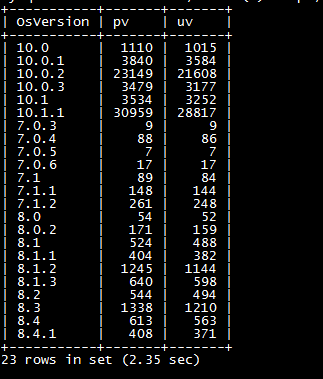

而其实我们非常关注这个问题的原因，不仅是线上版本的crash，更是在我们的开发分支，它的crash概率异常的高。如果不搞清楚触发crash的原因，那这将是一颗定时炸弹，不知道何时就会被我们合入主线，发布出去。因此我们着手开始做一些尝试。


尝试
--

首先我们的切入点是iOS 9和10.2 Beta没有crash。既然如此，能否将正常的代码合入微信，替换掉系统的呢？

### 尝试一：替换dylib

各版本的dylib可以在mac os的`~/Library/Developer/Xcode/iOS DeviceSupport/`找到，我们选了9.3.5的dylib。尝试编入时报错：

```c
ld: cannot link directly with /Users/sanhuazhang/Desktop/TestNanoCrash/libsystem_malloc.dylib.  Link against the umbrella framework 'System.framework' instead. for architecture arm64
clang: error: linker command failed with exit code 1 (use -v to see invocation)
```

这个是因为dylib的`LY_SUB_FRAMEWORK`段指明该dylib属于`System.framework`，直接被编译器拒绝了。看来没有办法。（如果有同学知道如何绕过这个保护，麻烦告知我）

### 尝试二：编入源码

`libsystem_malloc.dylib`的源码可以在<https://opensource.apple.com/tarballs/libmalloc/>找到。这里有多个版本，用otool找到iOS 9.3.5对应的源码是libmalloc-67.40.1.tar.gz。

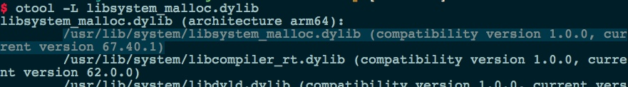

然而这份源码是不完整的，只能读不能编译。看来这个方法也行不通。


阅读源码
----

上述两个方法不行，就有点束手无策了，只能阅读源码，尝试找突破口。

在`libsystem_malloc.dylib`中，对内存的管理有两个实现：nano zone和scalable zone。他们分别管理不同大小的内存块：

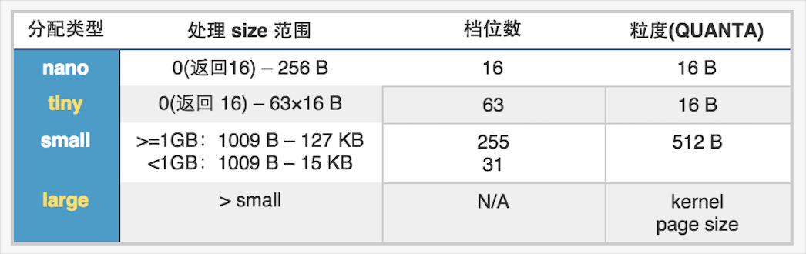

可以看到nano zone的管理区间和scalable zone是有重叠的，可以认为nano zone是一个针对小内存的优化方法。这两种方法通过MallocZoneNano的环境变量进行配置：

当`MallocZoneNano=1`时，default zone为nano zone，不满足nano zone的内存会fall through到它的helper zone，而helper zone是一个scalable zone。

当`MallocZoneNano=0`时，deafult zone为scalable zone。

通过`getenv("MallocZoneNano")`可以拿到环境变量的值，我们发现，在iOS 9和iOS 10.2 Beta中，`MallocZoneNano=0`，而其他系统`MallocZoneNano=1`。换句话说，苹果并不是修复了这个问题，而只是屏蔽了。因此其实我们在尝试一中提到替换dylib，即使替换成功，也是不解决问题的。

结合最初的crash堆栈，我们知道crash是发生在nano zone内的，那是否可以关掉nano zone呢？

### 尝试三：修改环境变量`MallocZoneNano=0`

通过`setenv`方法，可以设置环境变量，修改`MallocZoneNano=0`。然而并没有生效，因为dylib的初始化在微信之前，此时微信还未启动。

根据苹果的文档，Info.plist的`LSEnvironment`字段，可以设置环境变量，然而这个只适用于mac os。

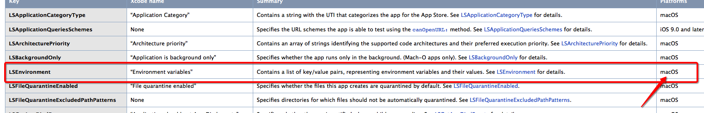

在Xcode的Schema里设置`MallocZoneNano=0`后，本地不再出现crash。

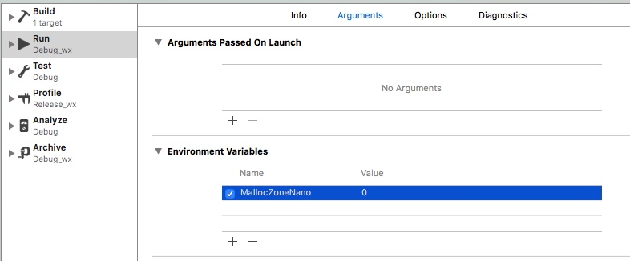

但schema只适用于调试阶段，不能编进app里。

看来这个方法也行不通，但起码验证了，关掉nano zone是一个可行的解决方案。

### 尝试四：hook

既然无法完全关闭nano zone，那就尝试跳过它。

首先通过`malloc_zone_create`创建一个新的zone，命名为guard zone。而自己的创建的zone都是scalable zone的实现，因此不会出现crash。然后通过fishhook，将`malloc`和`malloc_zone_malloc`等一众常用的内存管理的方法，转发到guard zone，crash概率降了不少。但fishhook无法hook掉其他dylib的调用，也就是说，系统的调用（如Cocoa、CoreFoundation等）依然是走nano zone，还是会crash。并不彻底解决问题。

### 尝试五：跳过nano zone

从上面我们知道，nano zone管理的是0-256字节的内存，如果内存不在这个区间，则会fall through到helper zone。而zone的结构是公开的：

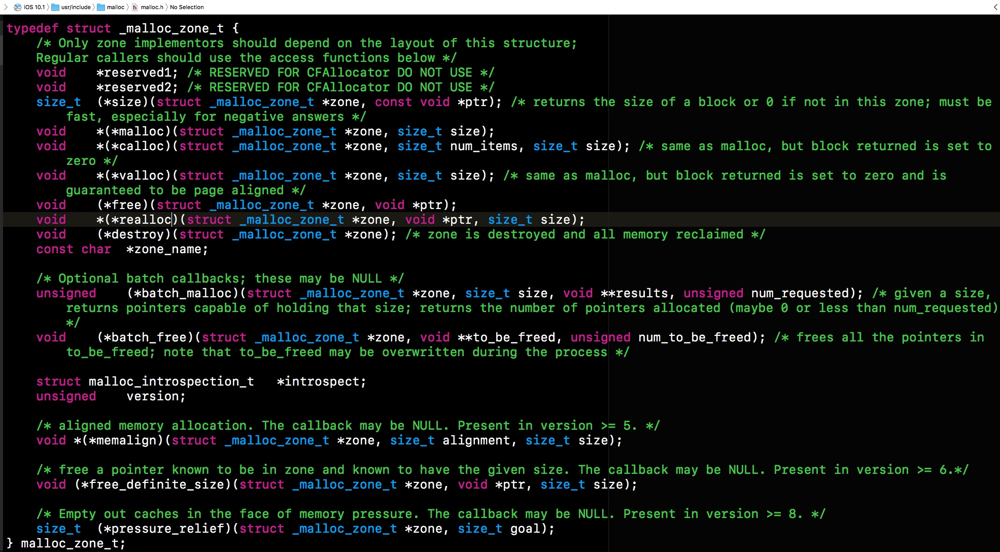

那么可以用tricky一点的方法：修改nano zone和helper zone的函数指针，让nano zone的内存申请虚增，超过256字节，以骗过nano zone，而fall through到helper zone后，再恢复为真正的大小。以malloc为例，具体实现为：


由于内存有限，size的最高位一般不会被使用，因此我们可以用这一位来标记。

当我满心以为终于解决问题时，却发现，crash概率不仅没有降低，反而到了几乎必现的程度。而此时除了少数在替换前就申请的内存是走的nano zone，其他内存都是在scalable zone内被管理。这一现象不禁让人怀疑，nano\_free的crash，很可能是zone判断错误 - 在scalable zone申请的内存，却在nano zone中释放。

要验证这个问题，还得从源码中搞清楚一个指针是怎么区分属于nano zone还是scalable zone的:

```coffee
//nano_malloc.c
#if defined(__x86_64)
#define NANO_SIGNATURE_BITS		20
#define NANOZONE_SIGNATURE		0x00006ULL			// 0x00006nnnnnnnnnnn the address range devoted to us.
#define NANO_MAG_BITS			5
#define NANO_BAND_BITS			18
#define NANO_SLOT_BITS			4
#define NANO_OFFSET_BITS		17
#else
#error Unknown Architecture
#endif

struct nano_blk_addr_s {
	uint64_t
nano_offset:NANO_OFFSET_BITS,		// locates the block
nano_slot:NANO_SLOT_BITS,		// bucket of homogenous quanta-multiple blocks
nano_band:NANO_BAND_BITS,
nano_mag_index:NANO_MAG_BITS,		// the core that allocated this block
nano_signature:NANO_SIGNATURE_BITS;	// 0x00006nnnnnnnnnnn the address range devoted to us.
};
```

可以看到，在x86下，是通过获取指针地址所属的段来判断zone的。当signature满足0x00006这个段时，则属于nano zone。

虽然这份代码里没有提供arm下的判断方式，但可以结合源码中对signature判断的函数，并通过符号断点，很快就能找到arm下比较signature的汇编。

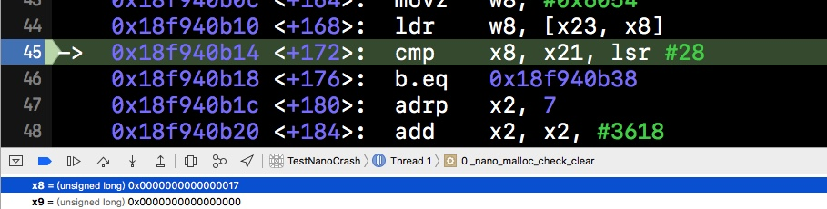

即：当ptr\>\>28==0x17时，属于nano zone。

通过测试代码可以发现，确实小于256字节的指针都是0x17。测试代码中大于256字节则落在了0x11。然而，代码跑了一阵子之后，大于256字节的指针也落在了0x17段。似乎我们已经很接近问题了。再来一段测试代码验明真身。

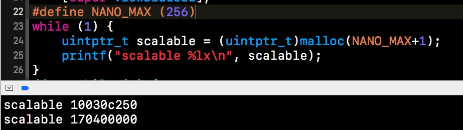

先通过循环不断地申请257字节的内存，并保存起来，这些内存应该都落在scalable zone中。刚开始的指针是0x11的，当出现0x17时，我们break掉。可以假设在此之后scalable zone内申请的内存，都是0x17，具体代码为：

```coffee
//Nano Crash测试代码，适用于iOS 10 真机
#define NANO_MAX (256)
std::vector<uintptr_t> ptrs;
while (1) {
    uintptr_t ptr = (uintptr_t)malloc(NANO_MAX+1);
    ptrs.push_back(ptr);
    if (ptr>>28==0x17) {
        break;
    }
}
```

我们新建了一个iOS的Single View Application，除了这段代码，没有做其他任何的修改。问题重现了：

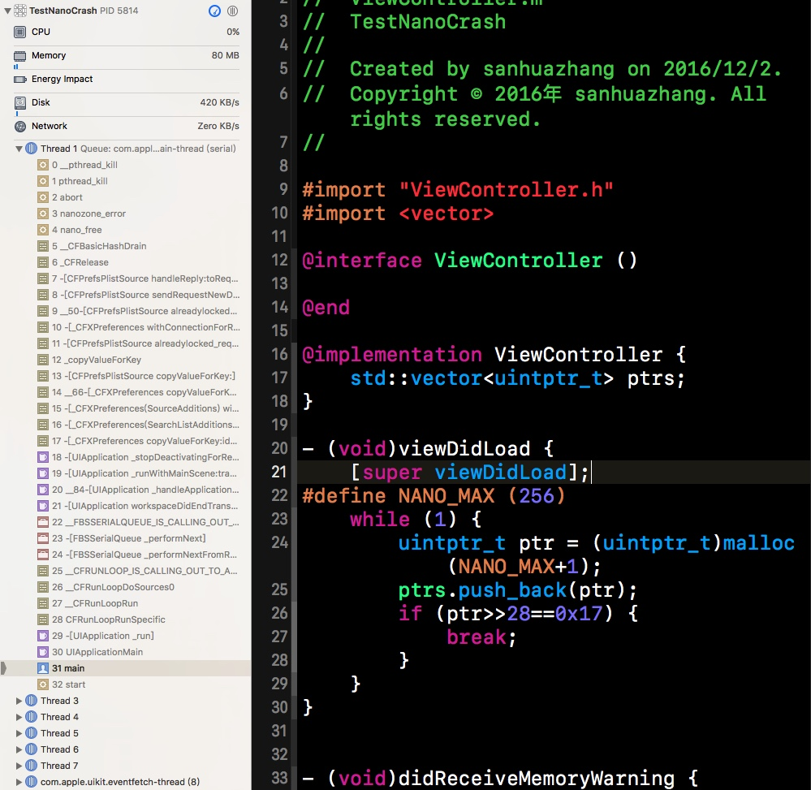

### 解决方案

从重现的代码来看，要真正减少nano crash的出现，只能是减少内存的使用，但这并不好操作。因此，解决思路还是回到保护上。

结合上面提到尝试3和4，我们进行了这样的修改。

1\. 创建一个自己的zone，命名为guard zone。

2\. 修改nano zone的函数指针，重定向到guard zone。

3\. 对于没有传入指针的函数，直接重定向到guard zone。

4\. 对于有传入指针的函数，先用size判断所属的zone，再进行分发。

这里需要特别注意的是，因为在修改函数指针前，已经有一部分指针在nano zone中申请了。因此需找到每个传入的指针所属的zone。代码示例为：

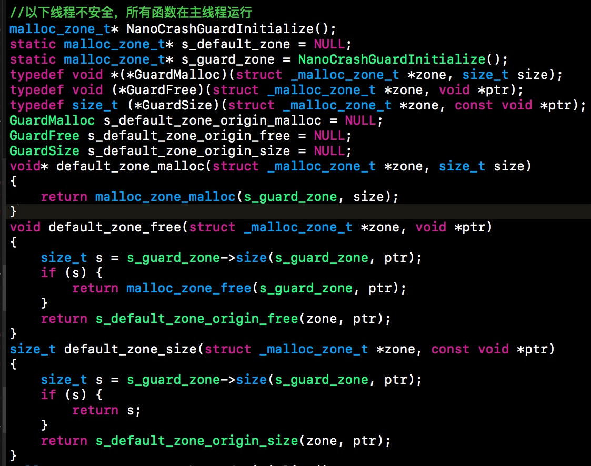

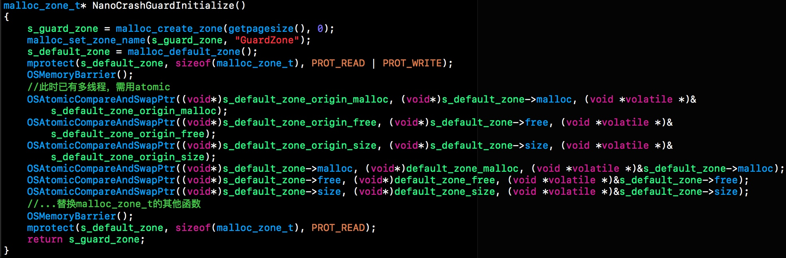

该问题不止有一种方式解决。这种方式目前还在灰度中，若要使用，请搭配适当的灰度和回退措施。


